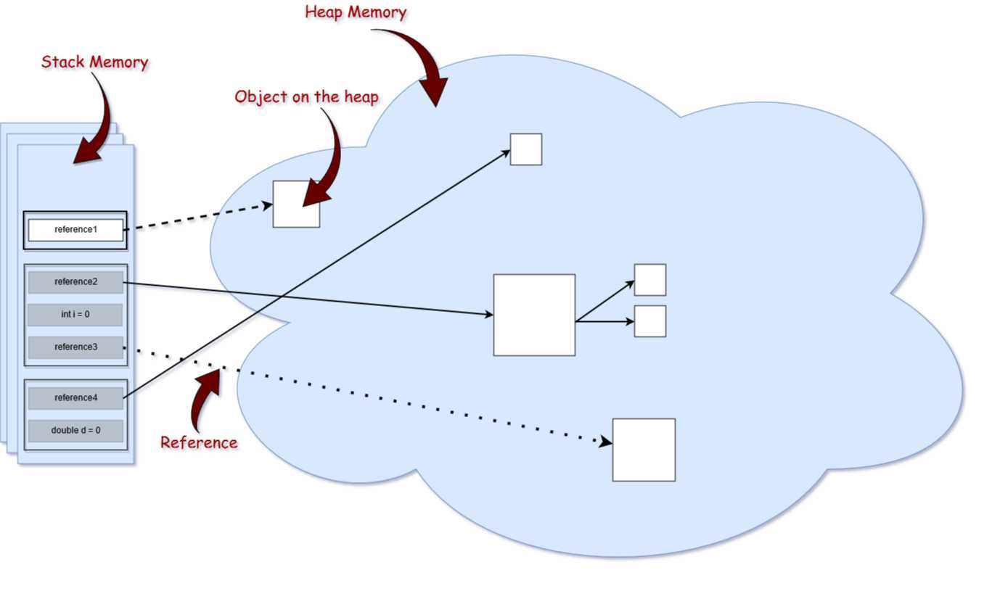

# Deep Java

1. [Java memory managment](#java-memory-managment)
    1. [Типы ссылок в Java](#type-of-link)
    1. [Советы и примеры](#recommendations)
1. [Сериализация](#serialization)
1. [Java Virtual Machine](#JVM)
1. [Garbage Collection](#GC)
1. [Многопоточность](#treads)

## Java memory managment 

Вам, как программисту на Java, не нужно беспокоиться о таких проблемах, как
уничтожение объектов, поскольку они больше не используются. Однако, даже если в
Java этот процесс выполняется автоматически, он ничего не гарантирует. Не зная,
как устроен сборщик мусора и память Java, вы можете создать объекты, которые не
подходят для сбора мусора, даже если вы их больше не используете.

Поэтому важно знать, как на самом деле работает память в Java, поскольку это
дает вам преимущество в написании высокопроизводительных и оптимизированных
приложений, которые никогда не будут аварийно завершены с ошибкой
OutOfMemoryError. С другой стороны, когда вы окажетесь в плохой ситуации, вы
сможете быстро найти утечку памяти.

Обычно память делится на две большие части: стек и куча. 

**Стек (Stack)** - Стековая память отвечает за хранение ссылок на объекты кучи и
за хранение типов значений (также известных в Java как примитивные типы),
которые содержат само значение, а не ссылку на объект из кучи.

Кроме того, переменные в стеке имеют определенную видимость, также называемую
областью видимости. Используются только объекты из активной области. Например,
предполагая, что у нас нет никаких глобальных переменных (полей) области
видимости, а только локальные переменные, если компилятор выполняет тело метода,
он может получить доступ только к объектам из стека, которые находятся внутри
тела метода. Когда метод завершается и возвращается, верхняя часть стека
выталкивается, и активная область видимости изменяется.

Стековая память в Java выделяется для каждого потока. Следовательно, каждый раз,
когда поток создается и запускается, он имеет свою собственную стековую память и
не может получить доступ к стековой памяти другого потока.

**Куча (Heap)** - это огромный объем памяти по сравнению со стеком. Она хранит в
памяти фактические объекты, на которые ссылаются переменные из стека. Например,
давайте проанализируем, что происходит в следующей строке кода:

~~~
StringBuilder builder = new StringBuilder();
~~~

Ключевое слово new несет ответственность за обеспечение того, достаточно ли
свободного места на куче, создавая объект типа StringBuilder в памяти и
обращаясь к нему через «Builder» ссылки, которая попадает в стек.

Для каждого запущенного процесса JVM существует только одна область памяти в
куче. Следовательно, это общая часть памяти независимо от того, сколько потоков
выполняется. Сама куча разделена на несколько частей, что облегчает процесс
сборки мусора.

Максимальные размеры стека и кучи не определены заранее - это зависит от
работающей JVM машины. 

### Типы ссылок в Java 

Как видно на изображение ссылки на объекты из кучи, относятся к разным типам.
Это потому, что в языке программирования Java используются разные типы ссылок:
сильные, слабые, мягкие и фантомные ссылки. Разница между типами ссылок
заключается в том, что объекты в куче, на которые они ссылаются, имеют право на
сборку мусора по различным критериям.

1. Сильная ссылка - это самые популярные ссылочные типы, к которым мы все
   привыкли. В приведенном выше примере со StringBuilder мы фактически храним
   сильную ссылку на объект из кучи. Объект в куче не удаляется сборщиком
   мусора, пока на него указывает сильная ссылка или если он явно доступен через
   цепочку сильных ссылок.

2. Слабая ссылка - слабая ссылка на объект из кучи, скорее всего, не сохранится
   после следующего процесса сборки мусора. Слабая ссылка создается следующим
   образом:
    ~~~
    WeakReference<StringBuilder> reference = new WeakReference<>(new StringBuilder()); 
    ~~~
    Хорошим вариантом использования слабых ссылок являются сценарии кеширования.
    Представьте, что вы извлекаете некоторые данные и хотите, чтобы они также
    были сохранены в памяти - те же данные могут быть запрошены снова. С другой
    стороны, вы не уверены, когда и будут ли эти данные запрашиваться снова.
    Таким образом, вы можете сохранить слабую ссылку на него, и в случае запуска
    сборщика мусора, возможно, он уничтожит ваш объект в куче. Следовательно,
    через некоторое время, если вы захотите получить объект, на который вы
    ссылаетесь, вы можете внезапно получить null значение. Хорошей реализацией
    сценариев кеширования является коллекция WeakHashMap <K, V>. Если мы откроем
    WeakHashMap класс в Java API, мы увидим, что его записи фактически расширяют
    WeakReference класс и используют его поле ref в качестве ключа отображения
    (Map):

    ~~~
    private static class Entry<K,V> extends WeakReference<Object> implements Map.Entry<K,V> { V value; }
    ~~~

    После сбора мусора ключа из WeakHashMap вся запись удаляется из карты.

3. Мягкая ссылка - эти типы ссылок используются для более чувствительных к
   памяти сценариев, поскольку они будут собираться сборщиком мусора только
   тогда, когда вашему приложению не хватает памяти. Следовательно, пока нет
   критической необходимости в освобождении некоторого места, сборщик мусора не
   будет касаться легко доступных объектов. Java гарантирует, что все объекты,
   на которые имеются мягкие ссылки, будут очищены до того, как будет выдано
   исключение OutOfMemoryError.

    Мягкая ссылка создается следующим образом:
    ~~~
    SoftReference<StringBuilder> reference = new SoftReference<>(new StringBuilder());
    ~~~

4. Фантомная ссылка - используется для планирования посмертных действий по
   очистке, поскольку мы точно знаем, что объекты больше не живы. Используется
   только с очередью ссылок, поскольку .get() метод таких ссылок всегда будет
   возвращаться null. Эти типы ссылок считаются предпочтительными для
   финализаторов.

**Ссылки на String** 

Cсылки на тип String в Java обрабатываются немного по- другому. Строки
неизменяемы, что означает, что каждый раз, когда вы делаете что-то со строкой, в
куче фактически создается другой объект. Для строк Java управляет пулом строк в
памяти. Это означает, что Java сохраняет и повторно использует строки, когда это
возможно. В основном это верно для строковых литералов.

~~~
String localPrefix = "297"; //1
String prefix = "297";      //2

if (prefix == localPrefix)
{
    System.out.println("Strings are equal" );
}
else
{
    System.out.println("Strings are different");
}   Строка  localPrefix  =  «297» ; // 1
~~~

При запуске этот код распечатывает следующее:

~~~
Strings are equal
~~~

Следовательно, оказывается, что две ссылки типа String на одинаковые строковые
литералы фактически указывают на одни и те же объекты в куче. Однако это не
действует для вычисляемых строк. Предположим, что у нас есть следующее изменение
в строке // 1 приведенного выше кода.

~~~
String localPrefix = new Integer(297).toString(); //1

Выввод: Strings are different
~~~

В этом случае мы фактически видим, что у нас есть два разных объекта в куче.
Если учесть, что вычисляемая строка будет использоваться довольно часто, мы
можем заставить JVM добавить ее в пул строк, добавив .intern()метод в конец
вычисляемой строки:

~~~
String localPrefix = new Integer(297).toString().intern(); //1
~~~

### Советы и приемы 

- Чтобы минимизировать объем памяти, максимально ограничьте область видимости
  переменных. Помните, что каждый раз, когда выскакивает верхняя область
  видимости из стека, ссылки из этой области теряются, и это может сделать
  объекты пригодными для сбора мусора.

- Явно устанавливайте в null устаревшие ссылки. Это сделает объекты, на которые
  ссылаются, подходящими для сбора мусора.

- Избегайте финализаторов (finalizer). Они замедляют процесс и ничего не
  гарантируют. Фантомные ссылки предпочтительны для работы по очистке памяти.

- Не используйте сильные ссылки там, где можно применить слабые или мягкие
  ссылки. Наиболее распространенные ошибки памяти - это сценарии кэширования,
  когда данные хранятся в памяти, даже если они могут не понадобиться.

- JVisualVM также имеет функцию создания дампа кучи в определенный момент, чтобы
  вы могли анализировать для каждого класса, сколько памяти он занимает.

- Настройте JVM в соответствии с требованиями вашего приложения. Явно укажите
  размер кучи для JVM при запуске приложения. Процесс выделения памяти также
  является дорогостоящим, поэтому выделите разумный начальный и максимальный
  объем памяти для кучи. Если вы знаете его, то не имеет смысла начинать с
  небольшого начального размера кучи с самого начала, JVM расширит это
  пространство памяти. Указание параметров памяти выполняется с помощью
  следующих параметров:

    - Начальный размер кучи -Xms512m- установите начальный размер кучи на 512
      мегабайт.

    - Максимальный размер кучи -Xmx1024m- установите максимальный размер кучи
      1024 мегабайта.

    - Размер стека потоков -Xss1m- установите размер стека потоков равным 1
      мегабайту.

    - Размер поколения -Xmn256m- установите размер поколения 256 мегабайт.

- Если приложение Java выдает ошибку OutOfMemoryErrorи вам нужна дополнительная
  информация для обнаружения утечки, запустите процесс с
  XX:HeapDumpOnOutOfMemoryпараметром, который создаст файл дампа кучи, когда эта
  ошибка произойдет в следующий раз.

- Используйте опцию -verbose:gc, чтобы получить вывод процесса сборки мусора.
  Каждый раз, когда происходит сборка мусора, будет генерироваться вывод.