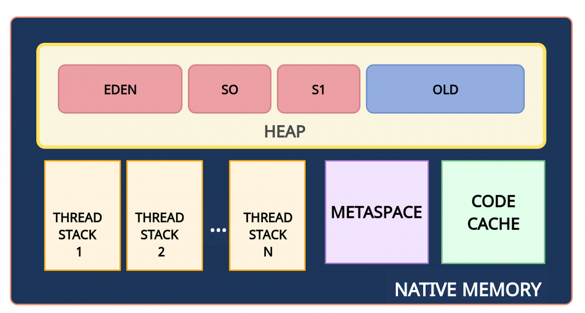
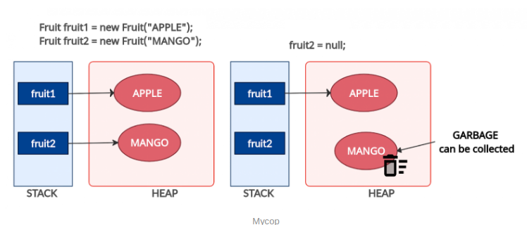
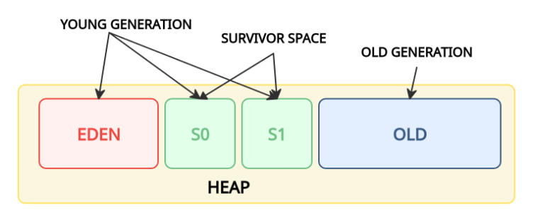

# Deep Java

1. [Java memory managment](#java-memory-managment)
  1. [Типы ссылок в Java](#type-of-link)
  1. [Советы и примеры](#recommendations)
1. [Сериализация](#serialization)
1. [Java Virtual Machine](#jvm)
1. [Garbage Collection](#GC)
1. [Многопоточность](#treads)

## Java memory managment 

Вам, как программисту на Java, не нужно беспокоиться о таких проблемах, как
уничтожение объектов, поскольку они больше не используются. Однако, даже если в
Java этот процесс выполняется автоматически, он ничего не гарантирует. Не зная,
как устроен сборщик мусора и память Java, вы можете создать объекты, которые не
подходят для сбора мусора, даже если вы их больше не используете.

Поэтому важно знать, как на самом деле работает память в Java, поскольку это
дает вам преимущество в написании высокопроизводительных и оптимизированных
приложений, которые никогда не будут аварийно завершены с ошибкой
OutOfMemoryError. С другой стороны, когда вы окажетесь в плохой ситуации, вы
сможете быстро найти утечку памяти.

Обычно память делится на две большие части: стек и куча. 

**Стек (Stack)** - Стековая память отвечает за хранение ссылок на объекты кучи и
за хранение типов значений (также известных в Java как примитивные типы),
которые содержат само значение, а не ссылку на объект из кучи.

Кроме того, переменные в стеке имеют определенную видимость, также называемую
областью видимости. Используются только объекты из активной области. Например,
предполагая, что у нас нет никаких глобальных переменных (полей) области
видимости, а только локальные переменные, если компилятор выполняет тело метода,
он может получить доступ только к объектам из стека, которые находятся внутри
тела метода. Когда метод завершается и возвращается, верхняя часть стека
выталкивается, и активная область видимости изменяется.

Стековая память в Java выделяется для каждого потока. Следовательно, каждый раз,
когда поток создается и запускается, он имеет свою собственную стековую память и
не может получить доступ к стековой памяти другого потока.

**Куча (Heap)** - это огромный объем памяти по сравнению со стеком. Она хранит в
памяти фактические объекты, на которые ссылаются переменные из стека. Например,
давайте проанализируем, что происходит в следующей строке кода:

~~~
StringBuilder builder = new StringBuilder();
~~~

Ключевое слово new несет ответственность за обеспечение того, достаточно ли
свободного места на куче, создавая объект типа StringBuilder в памяти и
обращаясь к нему через «Builder» ссылки, которая попадает в стек.

Для каждого запущенного процесса JVM существует только одна область памяти в
куче. Следовательно, это общая часть памяти независимо от того, сколько потоков
выполняется. Сама куча разделена на несколько частей, что облегчает процесс
сборки мусора.

Максимальные размеры стека и кучи не определены заранее - это зависит от
работающей JVM машины. 

### Типы ссылок в Java 

Как видно на изображение ссылки на объекты из кучи, относятся к разным типам.
Это потому, что в языке программирования Java используются разные типы ссылок:
сильные, слабые, мягкие и фантомные ссылки. Разница между типами ссылок
заключается в том, что объекты в куче, на которые они ссылаются, имеют право на
сборку мусора по различным критериям.

1. Сильная ссылка - это самые популярные ссылочные типы, к которым мы все
  привыкли. В приведенном выше примере со StringBuilder мы фактически храним
  сильную ссылку на объект из кучи. Объект в куче не удаляется сборщиком мусора,
  пока на него указывает сильная ссылка или если он явно доступен через цепочку
  сильных ссылок.

2. Слабая ссылка - слабая ссылка на объект из кучи, скорее всего, не сохранится
  после следующего процесса сборки мусора. Слабая ссылка создается следующим
  образом:
  ~~~
  WeakReference<StringBuilder> reference = new WeakReference<>(new StringBuilder()); 
  ~~~
  Хорошим вариантом использования слабых ссылок являются сценарии кеширования.
  Представьте, что вы извлекаете некоторые данные и хотите, чтобы они также были
  сохранены в памяти - те же данные могут быть запрошены снова. С другой
  стороны, вы не уверены, когда и будут ли эти данные запрашиваться снова. Таким
  образом, вы можете сохранить слабую ссылку на него, и в случае запуска
  сборщика мусора, возможно, он уничтожит ваш объект в куче. Следовательно,
  через некоторое время, если вы захотите получить объект, на который вы
  ссылаетесь, вы можете внезапно получить null значение. Хорошей реализацией
  сценариев кеширования является коллекция WeakHashMap <K, V>. Если мы откроем
  WeakHashMap класс в Java API, мы увидим, что его записи фактически расширяют
  WeakReference класс и используют его поле ref в качестве ключа отображения
  (Map):

  ~~~
  private static class Entry<K,V> extends WeakReference<Object> implements Map.Entry<K,V> { V value; }
  ~~~

  После сбора мусора ключа из WeakHashMap вся запись удаляется из карты.

3. Мягкая ссылка - эти типы ссылок используются для более чувствительных к
  памяти сценариев, поскольку они будут собираться сборщиком мусора только
  тогда, когда вашему приложению не хватает памяти. Следовательно, пока нет
  критической необходимости в освобождении некоторого места, сборщик мусора не
  будет касаться легко доступных объектов. Java гарантирует, что все объекты, на
  которые имеются мягкие ссылки, будут очищены до того, как будет выдано
  исключение OutOfMemoryError.

  Мягкая ссылка создается следующим образом:
  ~~~
  SoftReference<StringBuilder> reference = new SoftReference<>(new StringBuilder());
  ~~~

4. Фантомная ссылка - используется для планирования посмертных действий по
  очистке, поскольку мы точно знаем, что объекты больше не живы. Используется
  только с очередью ссылок, поскольку .get() метод таких ссылок всегда будет
  возвращаться null. Эти типы ссылок считаются предпочтительными для
  финализаторов.

**Ссылки на String** 

Cсылки на тип String в Java обрабатываются немного по- другому. Строки
неизменяемы, что означает, что каждый раз, когда вы делаете что-то со строкой, в
куче фактически создается другой объект. Для строк Java управляет пулом строк в
памяти. Это означает, что Java сохраняет и повторно использует строки, когда это
возможно. В основном это верно для строковых литералов.

~~~
String localPrefix = "297"; //1
String prefix = "297";      //2

if (prefix == localPrefix)
{
  System.out.println("Strings are equal" );
}
else
{
  System.out.println("Strings are different");
}   Строка  localPrefix  =  «297» ; // 1
~~~

При запуске этот код распечатывает следующее:

~~~
Strings are equal
~~~

Следовательно, оказывается, что две ссылки типа String на одинаковые строковые
литералы фактически указывают на одни и те же объекты в куче. Однако это не
действует для вычисляемых строк. Предположим, что у нас есть следующее изменение
в строке // 1 приведенного выше кода.

~~~
String localPrefix = new Integer(297).toString(); //1

Выввод: Strings are different
~~~

В этом случае мы фактически видим, что у нас есть два разных объекта в куче.
Если учесть, что вычисляемая строка будет использоваться довольно часто, мы
можем заставить JVM добавить ее в пул строк, добавив .intern()метод в конец
вычисляемой строки:

~~~
String localPrefix = new Integer(297).toString().intern(); //1
~~~

### Советы и приемы 

- Чтобы минимизировать объем памяти, максимально ограничьте область видимости
переменных. Помните, что каждый раз, когда выскакивает верхняя область видимости
из стека, ссылки из этой области теряются, и это может сделать объекты
пригодными для сбора мусора.

- Явно устанавливайте в null устаревшие ссылки. Это сделает объекты, на которые
ссылаются, подходящими для сбора мусора.

- Избегайте финализаторов (finalizer). Они замедляют процесс и ничего не
гарантируют. Фантомные ссылки предпочтительны для работы по очистке памяти.

- Не используйте сильные ссылки там, где можно применить слабые или мягкие
ссылки. Наиболее распространенные ошибки памяти - это сценарии кэширования,
когда данные хранятся в памяти, даже если они могут не понадобиться.

- JVisualVM также имеет функцию создания дампа кучи в определенный момент, чтобы
вы могли анализировать для каждого класса, сколько памяти он занимает.

- Настройте JVM в соответствии с требованиями вашего приложения. Явно укажите
размер кучи для JVM при запуске приложения. Процесс выделения памяти также
является дорогостоящим, поэтому выделите разумный начальный и максимальный объем
памяти для кучи. Если вы знаете его, то не имеет смысла начинать с небольшого
начального размера кучи с самого начала, JVM расширит это пространство памяти.
Указание параметров памяти выполняется с помощью следующих параметров:

  - Начальный размер кучи -Xms512m- установите начальный размер кучи на 512
    мегабайт.

  - Максимальный размер кучи -Xmx1024m- установите максимальный размер кучи 1024
    мегабайта.

  - Размер стека потоков -Xss1m- установите размер стека потоков равным 1
    мегабайту.

  - Размер поколения -Xmn256m- установите размер поколения 256 мегабайт.

- Если приложение Java выдает ошибку OutOfMemoryErrorи вам нужна дополнительная
информация для обнаружения утечки, запустите процесс с
XX:HeapDumpOnOutOfMemoryпараметром, который создаст файл дампа кучи, когда эта
ошибка произойдет в следующий раз.

- Используйте опцию -verbose:gc, чтобы получить вывод процесса сборки мусора.
Каждый раз, когда происходит сборка мусора, будет генерироваться вывод.

## Сериализация 

Сериализация - это процесс сохранения состояния объекта в последовательность
байт; десериализация это процесс восстановления объекта, из этих байт. Java
Serialization API предоставляет стандартный механизм для создания сериализуемых
объектов.

В сегодняшнем мире типичное промышленное приложение будет иметь множество
компонентов и будет распространено через различные системы и сети. В Java всё
представлено в виде объектов; Если двум компонентам Java необходимо общаться
друг с другом, то им необходим механизм для обмена данными. Есть несколько
способов реализовать этот механизм. Первый способ это разработать собственный
протокол и передать объект. Это означает, что получатель должен знать протокол,
используемый отправителем для воссоздания объекта, что усложняет разработку
сторонних компонентов. Следовательно, должен быть универсальный и эффективный
протокол передачи объектов между компонентами. Сериализация создана для этого, и
компоненты Java используют этот протокол для передачи объектов.

**Как сериализовать объект?**

Для начала следует убедиться, что класс сериализуемого объекта реализует
интерфейс java.io.Serializable.

~~~
import java.io.Serializable;

class TestSerial implements Serializable {
  public byte version = 100;
  public byte count = 0;
}
~~~

Следующим шагом будет фактическая сериализация объекта. Она делается вызовом
метода writeObject() класса java.io.ObjectOutputStream.

~~~
public static void main(String args[]) throws IOException {
  FileOutputStream fos = new FileOutputStream("temp.out");
  ObjectOutputStream oos = new ObjectOutputStream(fos);
  TestSerial ts = new TestSerial();
  oos.writeObject(ts);
  oos.flush();
  oos.close();
}
~~~

Для воссоздания объекта из файла, необходимо применить код:

~~~
public static void main(String args[]) throws IOException {
  FileInputStream fis = new FileInputStream("temp.out");
  ObjectInputStream oin = new ObjectInputStream(fis);
  TestSerial ts = (TestSerial) oin.readObject();
  System.out.println("version="+ts.version);
}
~~~

Восстановление объекта происходит с помощью вызова метода oin.readObject(). В
методе происходит чтение набора байт из файла и создаие точной копии графа
оригинального объекта. oin.readObject() может прочитать любой сериализованный
объект, поэтому необходимо полученный объект приводить к конкретному типу.
Выполненный код выведет version=100 в стандартный вывод.

**Формат сериализованного объекта**

Вспомните простой код, который сериализует объект класса TestSerial и записывает
в temp.out. В листинге 4 показано содержимое файла temp.out, в шестнадцатеричном
виде.

~~~
AC ED 00 05 73 72 00 0A 53 65 72 69 61 6C 54 65
73 74 A0 0C 34 00 FE B1 DD F9 02 00 02 42 00 05
63 6F 75 6E 74 42 00 07 76 65 72 73 69 6F 6E 78
70 00 64
~~~

Если вы снова посмотрите на TestSerial, то увидите, что у него всего 2 байтовых
члена. Как показано в листинге 5, а здесь 51 байт. Они добавлены сериализующим
алгоритмом и необходимы для воссоздания объекта. 

**Алгоритм сериализации Java**

Алгоритм сериализации делает следующие вещи:

- запись метаданных о классе ассоциированном с объектом
- рекурсивная запись описания суперклассов, до тех пор пока не будет достигнут
  java.lang.object
- после окончания записи метаданных начинается запись фактических данных
  ассоциированных с экземпляром, только в этот раз начинается запись с самого
  верхнего суперкласса
- рекурсивная запись данных ассоциированных с экземпляром начиная с самого
  низшего суперкласса

Подробнее о том, что означают какие байты в сериализации можно прочитать здесь:
[https://habr.com/ru/articles/60317/](https://habr.com/ru/articles/60317/)

## Java Virtual Machine 

Кроссплатформенность в Java обеспечивается явным разделением уровней языка и
реализации.

Языковой уровень. Разработчики пишут код на языке Java, синтаксис и семантика
которого описаны в Java Language Specification. После этого специальным
инструментом, который называется javac, исходный код компилируется в байт-код
Java. При этом происходит проверка синтаксиса, и в случае его нарушения
разработчик получает сообщение об ошибке от javac.

Что здесь важно:

- На этом этапе нет ничего платформенно-специфичного, весь код на языке Java
(как и байт-код Java) универсален.
- Байт-код Java — это язык, предназначенный не для людей, а для машин. Обычному
разработчику его читать не нужно.

Уровень реализации. Полученный байт-код Java передаётся на вход виртуальной
машины Java. И вот как именно она будет его исполнять, описано уже в другой
спецификации — Java Virtual Machine Specification. Со всеми особенностями
конкретной операционной системы или архитектуры процессора тоже разбирается JVM,
без влияния на исходный код на языке Java. Таким образом, происходит перенос
ответственности: разработчики на Java о таких неприятных вещах больше не думают,
им достаточно просто взять правильную JVM (например, для Linux x64). А все
OS/arch-специфические нюансы решают разработчики JVM.

Дженерики в Java, в отличие от многих других языков, — стираемые. Это означает,
что все типовые параметры стираются через javac до Object. В рантайме вы не
сможете понять, какой тип вам на самом деле пришёл. У этого подхода есть свои
плюсы и минусы, а споры о том, что лучше — стираемые или нестираемые дженерики —
продолжаются и по сей день.

Обратная совместимость — один из главных принципов Java, которым совет JCP не
пожертвует даже ради самой передовой фичи. От некоторых вещей иногда
отказываются, но при этом старый код всё равно должен продолжать работать.

## Garbage Collection

Для работы любого приложения требуется память. Однако память компьютера
ограничена. Поэтому важно ее очищать от старых неиспользуемых данных, чтобы
освободить место для новых.

Что такое "мусор"? Мусором считается объект, который больше не может быть
достигнут по ссылке из какого-либо объекта. Поскольку такие объекты больше не
используются в приложении, то их можно удалить из памяти.

Сборка мусора — это процесс автоматического управления памятью. Освобождение
памяти (путем очистки мусора) выполняется автоматически специальным компонентом
JVM — сборщиком мусора (Garbage Collector, GC). Нам, как программистам, нет
необходимости вмешиваться в процесс сборки мусора.

Сборка мусора: процесс Для сборки мусора используется алгоритм пометок (Mark &
Sweep). Этот алгоритм состоит из трех этапов:

- Mark (маркировка). На первом этапе GC сканирует все объекты и помечает живые
  (объекты, которые все еще используются). На этом шаге выполнение программы
  приостанавливается. Поэтому этот шаг также называется "Stop the World" .

- Sweep (очистка). На этом шаге освобождается память, занятая объектами, не
  отмеченными на предыдущем шаге.

- Compact (уплотнение). Объекты, пережившие очистку, перемещаются в единый
  непрерывный блок памяти. Это уменьшает фрагментацию кучи и позволяет проще и
  быстрее размещать новые объекты.

**Поколения объектов**

Для оптимизации сборки мусора память кучи дополнительно разделена на четыре области. В эти области объекты помещаются в зависимости от их возраста (как долго они используются в приложении).

1. Young Generation (молодое поколение). Здесь создаются новые объекты. Область young generation разделена на три части раздела: Eden (Эдем), S0 и S1 (Survivor Space — область для выживших).

2. Old Generation (старое поколение). Здесь хранятся давно живущие объекты.

**Гипотеза о поколениях**

Для оптимизации этапов mark и sweep используются поколения. Гипотеза о поколениях говорит о следующем:

1. Большинство объектов живут недолго.

1. Если объект выживает, то он, скорее всего, будет жить вечно.

1. Этапы mark и sweep занимают меньше времени при большом количестве мусора. То
   есть маркировка будет происходить быстрее, если анализируемая область
   небольшая и в ней много мертвых объектов.

Те процесс работы с поколениями выглядит следующим образом:

1. Новые объекты создаются в области Eden. Области Survivor (S0, S1) на данный
   момент пустые.

1. Когда область Eden заполняется, происходит минорная сборка мусора (Minor GC).
   Minor GC — это процесс, при котором операции mark и sweep выполняются для
   young generation (молодого поколения).

1. После Minor GC живые объекты перемещаются в одну из областей Survivor
   (например, S0). Мертвые объекты полностью удаляются.

1. По мере работы приложения пространство Eden заполняется новыми объектами. При
   очередном Minor GC области young generation и S0 очищаются. На этот раз
   выжившие объекты перемещаются в область S1, и их возраст увеличивается
   (отметка о том, что они пережили сборку мусора).

1. При следующем Minor GC процесс повторяется. Однако на этот раз области
   Survivor меняются местами. Живые объекты перемещаются в S0 и у них
   увеличивается возраст. Области Eden и S1 очищаются.

1. Объекты между областями Survivor копируются определенное количество раз (пока
   не переживут определенное количество Minor GC) или пока там достаточно места.
   Затем эти объекты копируются в область Old.

1. Major GC. При Major GC этапы mark и sweep выполняются для Old Generation.
   Major GC работает медленнее по сравнению с Minor GC, поскольку старое
   поколение в основном состоит из живых объектов.

