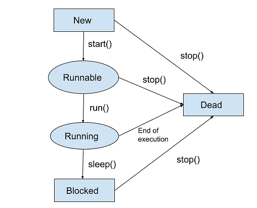
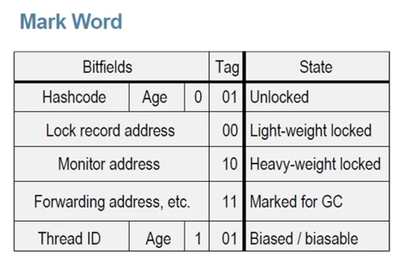

# Deep Java

1. [Java memory managment](#java-memory-managment)
    1. [Типы ссылок в Java](#type-of-link)
    1. [Советы и примеры](#recommendations)
1. [Сериализация](#serialization)
1. [Java Virtual Machine](#jvm)
1. [Garbage Collection](#gc)
1. [Рефлексия](#reflection)
1. [Многопоточность](#treads)
    1. [Синхронизация потоков](#synchronization)

## Java memory managment 

Вам, как программисту на Java, не нужно беспокоиться о таких проблемах, как
уничтожение объектов, поскольку они больше не используются. Однако, даже если в
Java этот процесс выполняется автоматически, он ничего не гарантирует. Не зная,
как устроен сборщик мусора и память Java, вы можете создать объекты, которые не
подходят для сбора мусора, даже если вы их больше не используете.

Поэтому важно знать, как на самом деле работает память в Java, поскольку это
дает вам преимущество в написании высокопроизводительных и оптимизированных
приложений, которые никогда не будут аварийно завершены с ошибкой
OutOfMemoryError. С другой стороны, когда вы окажетесь в плохой ситуации, вы
сможете быстро найти утечку памяти.

Обычно память делится на две большие части: стек и куча. 

**Стек (Stack)** - Стековая память отвечает за хранение ссылок на объекты кучи и
за хранение типов значений (также известных в Java как примитивные типы),
которые содержат само значение, а не ссылку на объект из кучи.

Кроме того, переменные в стеке имеют определенную видимость, также называемую
областью видимости. Используются только объекты из активной области. Например,
предполагая, что у нас нет никаких глобальных переменных (полей) области
видимости, а только локальные переменные, если компилятор выполняет тело метода,
он может получить доступ только к объектам из стека, которые находятся внутри
тела метода. Когда метод завершается и возвращается, верхняя часть стека
выталкивается, и активная область видимости изменяется.

Стековая память в Java выделяется для каждого потока. Следовательно, каждый раз,
когда поток создается и запускается, он имеет свою собственную стековую память и
не может получить доступ к стековой памяти другого потока.

**Куча (Heap)** - это огромный объем памяти по сравнению со стеком. Она хранит в
памяти фактические объекты, на которые ссылаются переменные из стека. Например,
давайте проанализируем, что происходит в следующей строке кода:

~~~
StringBuilder builder = new StringBuilder();
~~~

Ключевое слово new несет ответственность за обеспечение того, достаточно ли
свободного места на куче, создавая объект типа StringBuilder в памяти и
обращаясь к нему через «Builder» ссылки, которая попадает в стек.

Для каждого запущенного процесса JVM существует только одна область памяти в
куче. Следовательно, это общая часть памяти независимо от того, сколько потоков
выполняется. Сама куча разделена на несколько частей, что облегчает процесс
сборки мусора.

Максимальные размеры стека и кучи не определены заранее - это зависит от
работающей JVM машины. 

### Типы ссылок в Java 

Как видно на изображение ссылки на объекты из кучи, относятся к разным типам.
Это потому, что в языке программирования Java используются разные типы ссылок:
сильные, слабые, мягкие и фантомные ссылки. Разница между типами ссылок
заключается в том, что объекты в куче, на которые они ссылаются, имеют право на
сборку мусора по различным критериям.

1. Сильная ссылка - это самые популярные ссылочные типы, к которым мы все
  привыкли. В приведенном выше примере со StringBuilder мы фактически храним
  сильную ссылку на объект из кучи. Объект в куче не удаляется сборщиком мусора,
  пока на него указывает сильная ссылка или если он явно доступен через цепочку
  сильных ссылок.

2. Слабая ссылка - слабая ссылка на объект из кучи, скорее всего, не сохранится
  после следующего процесса сборки мусора. Слабая ссылка создается следующим
  образом:
  ~~~
  WeakReference<StringBuilder> reference = new WeakReference<>(new StringBuilder()); 
  ~~~
  Хорошим вариантом использования слабых ссылок являются сценарии кеширования.
  Представьте, что вы извлекаете некоторые данные и хотите, чтобы они также были
  сохранены в памяти - те же данные могут быть запрошены снова. С другой
  стороны, вы не уверены, когда и будут ли эти данные запрашиваться снова. Таким
  образом, вы можете сохранить слабую ссылку на него, и в случае запуска
  сборщика мусора, возможно, он уничтожит ваш объект в куче. Следовательно,
  через некоторое время, если вы захотите получить объект, на который вы
  ссылаетесь, вы можете внезапно получить null значение. Хорошей реализацией
  сценариев кеширования является коллекция WeakHashMap <K, V>. Если мы откроем
  WeakHashMap класс в Java API, мы увидим, что его записи фактически расширяют
  WeakReference класс и используют его поле ref в качестве ключа отображения
  (Map):

  ~~~
  private static class Entry<K,V> extends WeakReference<Object> implements Map.Entry<K,V> { V value; }
  ~~~

  После сбора мусора ключа из WeakHashMap вся запись удаляется из карты.

3. Мягкая ссылка - эти типы ссылок используются для более чувствительных к
  памяти сценариев, поскольку они будут собираться сборщиком мусора только
  тогда, когда вашему приложению не хватает памяти. Следовательно, пока нет
  критической необходимости в освобождении некоторого места, сборщик мусора не
  будет касаться легко доступных объектов. Java гарантирует, что все объекты, на
  которые имеются мягкие ссылки, будут очищены до того, как будет выдано
  исключение OutOfMemoryError.

  Мягкая ссылка создается следующим образом:
  ~~~
  SoftReference<StringBuilder> reference = new SoftReference<>(new StringBuilder());
  ~~~

4. Фантомная ссылка - используется для планирования посмертных действий по
  очистке, поскольку мы точно знаем, что объекты больше не живы. Используется
  только с очередью ссылок, поскольку .get() метод таких ссылок всегда будет
  возвращаться null. Эти типы ссылок считаются предпочтительными для
  финализаторов.

**Ссылки на String** 

Cсылки на тип String в Java обрабатываются немного по- другому. Строки
неизменяемы, что означает, что каждый раз, когда вы делаете что-то со строкой, в
куче фактически создается другой объект. Для строк Java управляет пулом строк в
памяти. Это означает, что Java сохраняет и повторно использует строки, когда это
возможно. В основном это верно для строковых литералов.

~~~
String localPrefix = "297"; //1
String prefix = "297";      //2

if (prefix == localPrefix)
{
  System.out.println("Strings are equal" );
}
else
{
  System.out.println("Strings are different");
}   Строка  localPrefix  =  «297» ; // 1
~~~

При запуске этот код распечатывает следующее:

~~~
Strings are equal
~~~

Следовательно, оказывается, что две ссылки типа String на одинаковые строковые
литералы фактически указывают на одни и те же объекты в куче. Однако это не
действует для вычисляемых строк. Предположим, что у нас есть следующее изменение
в строке // 1 приведенного выше кода.

~~~
String localPrefix = new Integer(297).toString(); //1

Выввод: Strings are different
~~~

В этом случае мы фактически видим, что у нас есть два разных объекта в куче.
Если учесть, что вычисляемая строка будет использоваться довольно часто, мы
можем заставить JVM добавить ее в пул строк, добавив .intern()метод в конец
вычисляемой строки:

~~~
String localPrefix = new Integer(297).toString().intern(); //1
~~~

### Советы и приемы 

- Чтобы минимизировать объем памяти, максимально ограничьте область видимости
переменных. Помните, что каждый раз, когда выскакивает верхняя область видимости
из стека, ссылки из этой области теряются, и это может сделать объекты
пригодными для сбора мусора.

- Явно устанавливайте в null устаревшие ссылки. Это сделает объекты, на которые
ссылаются, подходящими для сбора мусора.

- Избегайте финализаторов (finalizer). Они замедляют процесс и ничего не
гарантируют. Фантомные ссылки предпочтительны для работы по очистке памяти.

- Не используйте сильные ссылки там, где можно применить слабые или мягкие
ссылки. Наиболее распространенные ошибки памяти - это сценарии кэширования,
когда данные хранятся в памяти, даже если они могут не понадобиться.

- JVisualVM также имеет функцию создания дампа кучи в определенный момент, чтобы
вы могли анализировать для каждого класса, сколько памяти он занимает.

- Настройте JVM в соответствии с требованиями вашего приложения. Явно укажите
размер кучи для JVM при запуске приложения. Процесс выделения памяти также
является дорогостоящим, поэтому выделите разумный начальный и максимальный объем
памяти для кучи. Если вы знаете его, то не имеет смысла начинать с небольшого
начального размера кучи с самого начала, JVM расширит это пространство памяти.
Указание параметров памяти выполняется с помощью следующих параметров:

  - Начальный размер кучи -Xms512m- установите начальный размер кучи на 512
    мегабайт.

  - Максимальный размер кучи -Xmx1024m- установите максимальный размер кучи 1024
    мегабайта.

  - Размер стека потоков -Xss1m- установите размер стека потоков равным 1
    мегабайту.

  - Размер поколения -Xmn256m- установите размер поколения 256 мегабайт.

- Если приложение Java выдает ошибку OutOfMemoryErrorи вам нужна дополнительная
информация для обнаружения утечки, запустите процесс с
XX:HeapDumpOnOutOfMemoryпараметром, который создаст файл дампа кучи, когда эта
ошибка произойдет в следующий раз.

- Используйте опцию -verbose:gc, чтобы получить вывод процесса сборки мусора.
Каждый раз, когда происходит сборка мусора, будет генерироваться вывод.

## Сериализация 

Сериализация - это процесс сохранения состояния объекта в последовательность
байт; десериализация это процесс восстановления объекта, из этих байт. Java
Serialization API предоставляет стандартный механизм для создания сериализуемых
объектов.

В сегодняшнем мире типичное промышленное приложение будет иметь множество
компонентов и будет распространено через различные системы и сети. В Java всё
представлено в виде объектов; Если двум компонентам Java необходимо общаться
друг с другом, то им необходим механизм для обмена данными. Есть несколько
способов реализовать этот механизм. Первый способ это разработать собственный
протокол и передать объект. Это означает, что получатель должен знать протокол,
используемый отправителем для воссоздания объекта, что усложняет разработку
сторонних компонентов. Следовательно, должен быть универсальный и эффективный
протокол передачи объектов между компонентами. Сериализация создана для этого, и
компоненты Java используют этот протокол для передачи объектов.

**Как сериализовать объект?**

Для начала следует убедиться, что класс сериализуемого объекта реализует
интерфейс java.io.Serializable.

~~~
import java.io.Serializable;

class TestSerial implements Serializable {
  public byte version = 100;
  public byte count = 0;
}
~~~

Следующим шагом будет фактическая сериализация объекта. Она делается вызовом
метода writeObject() класса java.io.ObjectOutputStream.

~~~
public static void main(String args[]) throws IOException {
  FileOutputStream fos = new FileOutputStream("temp.out");
  ObjectOutputStream oos = new ObjectOutputStream(fos);
  TestSerial ts = new TestSerial();
  oos.writeObject(ts);
  oos.flush();
  oos.close();
}
~~~

Для воссоздания объекта из файла, необходимо применить код:

~~~
public static void main(String args[]) throws IOException {
  FileInputStream fis = new FileInputStream("temp.out");
  ObjectInputStream oin = new ObjectInputStream(fis);
  TestSerial ts = (TestSerial) oin.readObject();
  System.out.println("version="+ts.version);
}
~~~

Восстановление объекта происходит с помощью вызова метода oin.readObject(). В
методе происходит чтение набора байт из файла и создаие точной копии графа
оригинального объекта. oin.readObject() может прочитать любой сериализованный
объект, поэтому необходимо полученный объект приводить к конкретному типу.
Выполненный код выведет version=100 в стандартный вывод.

**Формат сериализованного объекта**

Вспомните простой код, который сериализует объект класса TestSerial и записывает
в temp.out. В листинге 4 показано содержимое файла temp.out, в шестнадцатеричном
виде.

~~~
AC ED 00 05 73 72 00 0A 53 65 72 69 61 6C 54 65
73 74 A0 0C 34 00 FE B1 DD F9 02 00 02 42 00 05
63 6F 75 6E 74 42 00 07 76 65 72 73 69 6F 6E 78
70 00 64
~~~

Если вы снова посмотрите на TestSerial, то увидите, что у него всего 2 байтовых
члена. Как показано в листинге 5, а здесь 51 байт. Они добавлены сериализующим
алгоритмом и необходимы для воссоздания объекта. 

**Алгоритм сериализации Java**

Алгоритм сериализации делает следующие вещи:

- запись метаданных о классе ассоциированном с объектом
- рекурсивная запись описания суперклассов, до тех пор пока не будет достигнут
  java.lang.object
- после окончания записи метаданных начинается запись фактических данных
  ассоциированных с экземпляром, только в этот раз начинается запись с самого
  верхнего суперкласса
- рекурсивная запись данных ассоциированных с экземпляром начиная с самого
  низшего суперкласса

Подробнее о том, что означают какие байты в сериализации можно прочитать здесь:
[https://habr.com/ru/articles/60317/](https://habr.com/ru/articles/60317/)

## Java Virtual Machine 

Кроссплатформенность в Java обеспечивается явным разделением уровней языка и
реализации.

Языковой уровень. Разработчики пишут код на языке Java, синтаксис и семантика
которого описаны в Java Language Specification. После этого специальным
инструментом, который называется javac, исходный код компилируется в байт-код
Java. При этом происходит проверка синтаксиса, и в случае его нарушения
разработчик получает сообщение об ошибке от javac.

Что здесь важно:

- На этом этапе нет ничего платформенно-специфичного, весь код на языке Java
(как и байт-код Java) универсален.
- Байт-код Java — это язык, предназначенный не для людей, а для машин. Обычному
разработчику его читать не нужно.

Уровень реализации. Полученный байт-код Java передаётся на вход виртуальной
машины Java. И вот как именно она будет его исполнять, описано уже в другой
спецификации — Java Virtual Machine Specification. Со всеми особенностями
конкретной операционной системы или архитектуры процессора тоже разбирается JVM,
без влияния на исходный код на языке Java. Таким образом, происходит перенос
ответственности: разработчики на Java о таких неприятных вещах больше не думают,
им достаточно просто взять правильную JVM (например, для Linux x64). А все
OS/arch-специфические нюансы решают разработчики JVM.

Дженерики в Java, в отличие от многих других языков, — стираемые. Это означает,
что все типовые параметры стираются через javac до Object. В рантайме вы не
сможете понять, какой тип вам на самом деле пришёл. У этого подхода есть свои
плюсы и минусы, а споры о том, что лучше — стираемые или нестираемые дженерики —
продолжаются и по сей день.

Обратная совместимость — один из главных принципов Java, которым совет JCP не
пожертвует даже ради самой передовой фичи. От некоторых вещей иногда
отказываются, но при этом старый код всё равно должен продолжать работать.

## Garbage Collection 

Для работы любого приложения требуется память. Однако память компьютера
ограничена. Поэтому важно ее очищать от старых неиспользуемых данных, чтобы
освободить место для новых.

Что такое "мусор"? Мусором считается объект, который больше не может быть
достигнут по ссылке из какого-либо объекта. Поскольку такие объекты больше не
используются в приложении, то их можно удалить из памяти.

Сборка мусора — это процесс автоматического управления памятью. Освобождение
памяти (путем очистки мусора) выполняется автоматически специальным компонентом
JVM — сборщиком мусора (Garbage Collector, GC). Нам, как программистам, нет
необходимости вмешиваться в процесс сборки мусора.

Сборка мусора: процесс Для сборки мусора используется алгоритм пометок (Mark &
Sweep). Этот алгоритм состоит из трех этапов:

- Mark (маркировка). На первом этапе GC сканирует все объекты и помечает живые
  (объекты, которые все еще используются). На этом шаге выполнение программы
  приостанавливается. Поэтому этот шаг также называется "Stop the World" .

- Sweep (очистка). На этом шаге освобождается память, занятая объектами, не
  отмеченными на предыдущем шаге.

- Compact (уплотнение). Объекты, пережившие очистку, перемещаются в единый
  непрерывный блок памяти. Это уменьшает фрагментацию кучи и позволяет проще и
  быстрее размещать новые объекты.

**Поколения объектов**

Для оптимизации сборки мусора память кучи дополнительно разделена на четыре
области. В эти области объекты помещаются в зависимости от их возраста (как
долго они используются в приложении).

1. Young Generation (молодое поколение). Здесь создаются новые объекты. Область
   young generation разделена на три части раздела: Eden (Эдем), S0 и S1
   (Survivor Space — область для выживших).

2. Old Generation (старое поколение). Здесь хранятся давно живущие объекты.

**Гипотеза о поколениях**

Для оптимизации этапов mark и sweep используются поколения. Гипотеза о
поколениях говорит о следующем:

1. Большинство объектов живут недолго.

1. Если объект выживает, то он, скорее всего, будет жить вечно.

1. Этапы mark и sweep занимают меньше времени при большом количестве мусора. То
   есть маркировка будет происходить быстрее, если анализируемая область
   небольшая и в ней много мертвых объектов.

Те процесс работы с поколениями выглядит следующим образом:

1. Новые объекты создаются в области Eden. Области Survivor (S0, S1) на данный
   момент пустые.

1. Когда область Eden заполняется, происходит минорная сборка мусора (Minor GC).
   Minor GC — это процесс, при котором операции mark и sweep выполняются для
   young generation (молодого поколения).

1. После Minor GC живые объекты перемещаются в одну из областей Survivor
   (например, S0). Мертвые объекты полностью удаляются.

1. По мере работы приложения пространство Eden заполняется новыми объектами. При
   очередном Minor GC области young generation и S0 очищаются. На этот раз
   выжившие объекты перемещаются в область S1, и их возраст увеличивается
   (отметка о том, что они пережили сборку мусора).

1. При следующем Minor GC процесс повторяется. Однако на этот раз области
   Survivor меняются местами. Живые объекты перемещаются в S0 и у них
   увеличивается возраст. Области Eden и S1 очищаются.

1. Объекты между областями Survivor копируются определенное количество раз (пока
   не переживут определенное количество Minor GC) или пока там достаточно места.
   Затем эти объекты копируются в область Old.

1. Major GC. При Major GC этапы mark и sweep выполняются для Old Generation.
   Major GC работает медленнее по сравнению с Minor GC, поскольку старое
   поколение в основном состоит из живых объектов.

## Рефлейксия 

Рефлексия позволяет исследовать информацию о полях, методах и конструкторах классов. Те мы рассматриваем сущность какого-нибудь класса, как экземпляр. Те мы рассматриваем класс как экземпляр класса Class, где его поля это:
~~~
class Class {
    String name;
    String packageName;
    List<Attribute> attributes;
    List<Method> methods;
}
~~~

Существует 3 способа получить доступ к нашему классу, как к экземпляру Class:

1. Class c = MyClass.class; // обращение к классу
1. Class c = obj.getClass; // обращение к экземпляру
1. Class c = Class.forName("ru.alisve.MyClass") // через путь

Основные методы при работе с Class: 

1. Object o1 = c.newInstance() // создать экземпляр класса с пустым 
   конструктором.
1. Object o1 = c.getConstructor(String.class).newInstance("...") // находим 
   конструктор, который принимает строку и передаем ему это значение строки
1. Method[] m = c.getMethods(); // получить массив методов
    1. m[i].getName(); // имя метода
    1. m[i].getReturnType(); // возвращаемый тип
    1. m[i].getParameterTypes(); // принимаемые параметры
    1. m[i].invoke(o1, ...) // вызывает метод к экземпляру класса o1, затем 
       передаются параметры с которыми он вызывается. 
1. c.getFields(); // получаем список полей класса (getDeclaredFields возвращает
   еще и запреваченные поля)
1. c.getAnnotation();   // посмотреть все аннотации

Пример:

На вход подаются имена двух классаов и метода первого класса. Нужно вызвать метод с параметром - второй класс.

~~~
// получаем класс1 и класс2 по имени из консоли
Class classObject1 = Class.forName(scanner.next());
Class class0bject2 = Class.forName(scanner.next()); 

// получаем название метода
String methodName = scanner.next();

// получаем метод по названию и набору параметров (в данном примере это класс2)
Method m = class0bject1.getMethod(methodName, class0bject2);

// создаем экземпляры класса1 с пустым конструктором
// и класса2 с конструктором принимающим строку и значением строки:
// "String values" 
Object o1 = class0bject1.newInstance();
Object o2 = class0bject2.getConstructor(String.class).newInstance("String 
value");

// вызываем метод класса1 на экземпляре1, как параметр передавая экземпляр2
m.invoke(o1, o2);

// выводим результат
System.out.println(o1);
~~~

## Многопоточность 

Поток - это минимальная вычеслительная единица, которой операционная система
выделяет время процессора. JVM позволяет приложению выполнять несколько потоков
одновременно. Каждый поток имеет свой приоритет. Потоки с более высоким
приоритетом выполняются предпочтительнее. Каждый поток также может быть помечен
как демон (фоновый поток). Приоретет и статус демона наследуется у родительского
потока (потока, в котором создан новый поток).

Когда запускается JVM, обычно существует один поток, не являющийся демоном
(который обычно вызывает метод с именем main некоторого назначенного класса).
JVM продолжает выполнять потоки до тех пор, пока не произойдет одно из следующих
событий:

- Был вызван метод  Runtime.exit.
- Все НЕ демон-потоки завершили свою работу (как без ошибок, так и с
  выбрасыванием исключений).

Есть два способа создать новый поток выполнения. Один из них заключается в
объявлении класса подклассом Thread. Этот подкласс должен переопределять метод
run класса Thread. Затем может быть выделен и запущен экземпляр подкласса. 

~~~
public class TestThread extends Thread {
    @Override
    public void run() {
        System.out.println("Thread is Running Successfully " + Thread.currentThread().getName());
    }
}

public class Main {
    public static void main(String[] args) {
        TestThread t1 = new TestThread();
        TestThread t2 = new TestThread();
        t1.start();
        t2.start();
    }
}

Thread is Running Successfully Thread-1
Thread is Running Successfully Thread-0
~~~

Другой способ создать поток - объявить класс/фунцию, которая реализует интерфейс
Runnable. Затем этот класс реализует метод run. Затем может быть выделен
экземпляр класса, передан в качестве аргумента при создании потока и запущен.
Тот же пример в этом другом стиле выглядит следующим образом:

~~~
public class Main {
    public static void main(String[] args) {
        Runnable task = () -> {
            System.out.println("Thread is Running Successfully " + Thread.currentThread().getName());
        };

        Thread th1 = new Thread(task);
        Thread th2 = new Thread(task);
        Thread th3 = new Thread(task);
        th1.start();
        th2.start();
        th3.start();
    }
}

Thread is Running Successfully Thread-1
Thread is Running Successfully Thread-0
Thread is Running Successfully Thread-2
~~~

Каждый поток входит в какую-то группу (ThreadGroup). А группы могут входит друг
в друга, образовывая некоторую иерархию или структуру. Группы позволяют
упорядочить управление потоками и вести их учёт.

Жизненный цикл потоков:

### Проблемма некогерентности кэшей процессора

Во время выполнения многопоточной программы, при изменение переменной из другого потока, может возникнуть ситуация, что в одном потоке переменная измениться, а в другом нет (тк процессор закеширует значение этой переменной).

Для решения этой проблеммы используется слово volatile, которая говорит, что
переменная может быть изменена и ее не надо кэшировать.

Пример:

~~~
public static void main(String[] args) {

    MyThread myThread = new MyThread();
    myThread.start();
    Scanner scanner = new Scanner(System.in);
    scanner.nextLine();
    myThread.shutdown();
}

static class MyThread extends Thread {
    private boolean volatile running = true; // данная переменная     
                                            //может закешироваться

    public void run() {
        while (running) {
            System.out.println("Hello");
        }
    }
    public void shutdown() {
        this.running = false;
    }
}
~~~

### Синхронизация потоков 

**Sleep - Засыпание потока**

Поток в процессе своего выполнения может засыпать. Это самой простой тип
взаимодействия с другими потоками. В операционной системе, на которой
установлена виртуальная Java машина, где выполняется Java код, есть свой
планировщик потоков, называемый Thread Scheduler. Именно он решает, какой поток
когда запускать. 

Программист не может взаимодействовать с этим планировщиком напрямую из Java
кода, но он может через JVM попросить планировщик на какое-то время поставить
поток на паузу, "усыпить" его.

~~~
class Test {
    public static void main(String []args) {
        Runnable task = () -> {
            try {
                int secToWait = 60;
                Thread.currentThread().sleep(secToWait);
                System.out.println("Waked up");
            } catch (InterruptedException e) {
                e.printStackTrace();
            }
        };
        Thread thread = new Thread(task);
        thread.start();
    }
}
~~~

**Прерывание потока или Thread.interrupt**

Еще один способ вызова завершения или прерывания потока представляет метод
interrupt(). Вызов этого метода устанавливает у потока статус, что он прерван.
Сам метод возвращает true, если поток может быть прерван, в ином случае
возвращается false.

При этом сам вызов этого метода НЕ завершает поток, он только устанавливает
статус: в частности, метод isInterrupted() класса Thread будет возвращать
значение true. 

А также, если поток прерывается через Interupte, а в нем остались действия, то в нем вызывается исключение Interupte exeption.

~~~
public static void main(String []args) {
	Runnable task = () -> {
		for (int i = 0;i < 100; i++>)
            if (Thread.currentTread().isInterupted())
        	    breadk;
            TimeUnit.SECONDS.sleep(60);
	};
	Thread thread = new Thread(task);
	thread.start();
	thread.interrupt();
}
~~~

Не дожидаясь 60 секунд, наша программа завершится и выведет: interrupt.

**Join — Ожидание завершения другого потока**

Самым простым типом ожидания является ожидание завершения другого потока.

~~~
public static void test() throws InterruptedException {
    Runnable task = () -> {
        try {
            System.out.println("UnMain Thread start run");
            TimeUnit.SECONDS.sleep(5);
        } catch (InterruptedException e) {
            System.out.println("Interrupted");
        }
    };
    Thread thread = new Thread(task);
    thread.start();
    thread.join();
    System.out.println("Main Thread continue run");
}
~~~

В данном примере новый поток будет спать 5 секунд. В то же время, главный поток
main будет ждать, пока спящий поток не проснётся и не завершит свою работу. 

**Блокировки**

Монитор существует у каждого объекта, это своего рода диспетчер, который 
говорит занят этот объект каким-то потоком или нет.

Для целей синхронизации между потоками Java использует некий механизм, который
называется "Монитор". С каждым объектом ассоциирован некоторый монитор, а
потоки могут его заблокировать "lock" или разблокировать "unlock".

Далее важно понять, каким образом объект в Java может быть связан с монитором.
У каждого объекта в Java есть заголовок (header) — своего рода внутренние 
метаданные, которые недоступны программисту из кода, но которые нужны
виртуальной машине, чтобы работать с объектами правильно.

В состав заголовка объекта входит MarkWord, которое выглядит следующим образом:

~~~
public class HelloWorld{
    public static void main(String []args){
        Object object = new Object();
        synchronized(object) {
            System.out.println("Hello World");
        }
    }
}
~~~

Аналогично можно синхронезировать не по объекту, а через метод:

~~~
public synchronized void Hello(){
    System.out.println("Hello World");
}
~~~

Итак, при помощи ключевого слова synchronized текущий поток (в котором
выполняются эти строки кода) пытается использовать монитор, ассоциированный с
объектом object "захватить монитор". Если за монитор нет соперничества (т.е.
никто больше не хочет выполнить synchronized по такому же объекту), Java может
попытаться выполнить оптимизацию, называемую "biased locking". В заголовке
объекта в Mark Word выставится соответствующий тэг и запись о том, к какому
потоку привязан монитор. Это позволяет сократить накладные расходы при
захватывании монитора.

Если монитор уже ранее был привязан к другому потоку, тогда такой блокировки
недостаточно. JVM переключается на следующий тип блокировки — basic locking. Она
использует compare-and-swap (CAS) операции. При этом в заголовке в Mark Word уже
хранится не сам Mark Word, а ссылка на его хранение + изменяется тэг, чтобы JVM
поняла, что у нас используется базовая блокировка.

Если же возникает соперничество (contention) за монитор нескольких потоков (один
захватил монитор, а второй ждёт освобождение монитора), тогда тэг в Mark Word
меняется, и в Mark Word начинает храниться ссылка уже на монитор как объект —
некоторую внутреннюю сущность JVM. Как сказано в JEP, в таком случае требуется
место в Native Heap области памяти на хранение этой сущности. Ссылка на место
хранения этой внутренней сущности и будет находиться в Mark Word объекта.

Таким образом, как мы видим, монитор — это действительно механизм обеспечения
синхронизации доступа нескольких потоков к общим ресурсам. 

~~~
public static void main(String[] args) throws InterruptedException {
	Object lock = new Object();

	Runnable task = () -> {
		synchronized (lock) {
			System.out.println("thread");
		}
	};

	Thread th1 = new Thread(task);
	th1.start();
	synchronized (lock) {
		for (int i = 0; i < 8; i++) {
			Thread.currentThread().sleep(1000);
			System.out.print("  " + i);
		}
		System.out.println(" ...");
	}
}
~~~

Здесь главный поток сначала отправляет задачу task в новый поток, а потом сразу
же "захватывает" лок и выполняет с ним долгую операцию (8 секунд). Всё это время
task не может для своего выполнения зайти в блок synchronized, т.к. лок уже
занят.

Рассмотрим другой пример:
~~~
public static void test() throws InterruptedException {
  Object lock = new Object();

  Runnable task = () -> {
      for (int i = 0; i < 8; i++) {
          try {
              Thread.currentThread().sleep(1000);
          } catch (InterruptedException e) {
              throw new RuntimeException(e);
          }

          System.out.println("thread");
      }
  };

  Thread th1 = new Thread(task);
  th1.start();
  for (int i = 0; i < 8; i++) {
      Thread.currentThread().sleep(1000);
      System.out.print("  " + i);
  }
}

thread
0
thread
1
thread
2
thread
3
thread
4
thread
5
thread
6
~~~

Тут все очевидно, потоки выполняются паралельно, добавим блокировку.

~~~
public static void test() throws InterruptedException {
  Object lock = new Object();

  Runnable task = () -> {
      synchronized (lock) {
          for (int i = 0; i < 8; i++) {
              try {
                  Thread.currentThread().sleep(1000);
              } catch (InterruptedException e) {
                  throw new RuntimeException(e);
              }

              System.out.println("thread");
          }
      }
  };

  Thread th1 = new Thread(task);
  th1.start();
  synchronized (lock) {
      for (int i = 0; i < 8; i++) {
          Thread.currentThread().sleep(1000);
          System.out.print("  " + i);
      }
  }
}

0  1  2  3  4  5  6  7
thread
thread
thread
thread
thread
thread
thread
thread
~~~

Здесь главный поток сначала отправляет задачу task в новый поток, а потом сразу же "захватывает" лок и выполняет с ним долгую операцию (8 секунд). Всё это время task не может для своего выполнения зайти в блок synchronized, т.к. лок уже занят.

Еще один интересный пример, когда нужно использовать блокировку по объекту:

~~~
public void f1(){
    System.out.println("hellow");
}

public void f2(){
    System.out.println("hellow");
}

Runnable task = () -> {
    for (int i=0;i<1000;i++)
        f1();
        f2();

Thread th1 = new Thread(task);
Thread th2 = new Thread(task);
th1.start();
th2.start();
}
~~~

Если мы просто синхронизируем функции, то время выполнения будет такое же, как 
и в однопоточном режиме.

Поэтому нужно синхронизировать по монитору, тогда у нас поток пока ждет разблокировки монитора одного объекта, может выполнить действия с другим объектом.

~~~
Object lock1 = new Object();
Object lock2 = new Object();

public void f1(){
    synchronized (lock1){
        System.out.println("hellow");
    }
}

public void f2(){
    synchronized (lock2){
        System.out.println("buy");
    }
}

Runnable task = () -> {
    for (int i=0;i<1000;i++)
        f1();
        f2();

Thread th1 = new Thread(task);
Thread th2 = new Thread(task);
th1.start();
th2.start();
}
~~~

**Wait и ожидание по монитору.**

У Thread есть ещё один метод ожидания, который при этом связан с монитором. В
отличие от sleep и join, его нельзя просто так вызвать. И зовут его wait.

Выполняется метод wait на объекте, на мониторе которого мы хотим выполнить
ожидание. 

~~~
public static void test() throws InterruptedException {
  Object lock = new Object();
  Runnable task = () -> {
      synchronized(lock) {
          try {
              System.out.println("Wait main thread");
              lock.wait();
          } catch(InterruptedException e) {
              System.out.println("interrupted");
          }
      }
      System.out.println("Continue run threads");
  };
  Thread taskThread = new Thread(task);
  taskThread.start();
  Thread.currentThread().sleep(3000);
  synchronized(lock) {
      System.out.println("Complete wait main thread");
      lock.notify();
  }
}

Wait main thread
Complete wait main thread
Continue run threads
~~~

Поток main создаёт новый поток с задачей task, запускает его и ждёт 3 секунды.
Это позволяет с большой долей вероятности новому потоку захватить лок прежде,
чем поток main, и встать в очередь по монитору. После чего поток main сам входит
в блок синхронизации по lock и выполняет уведомление потока по монитору. После
того, как уведомление отправлено, поток main освобождает монитор lock, а новый
поток (который ранее ждал) дождавшись освобождения монитора lock, продолжает
выполнение.

В примере выше в задаче task описано, что мы входим в блок синхронизации по
монитору, ассоциированному с lock. Если удаётся получить лок по этому монитору,
то выполняется wait. Поток, выполняющий этот task, будет освобождать монитор
lock, но становиться в очередь потоков, ожидающих уведомления по монитору lock.
Эта очередь потоков называется WAIT-SET, что более правильно отражает суть. Это
скорее набор, а не очередь.

Существует возможность отправить уведомление только одному из потоков (notify)
или сразу всем потокам из очереди (notifyAll).

**ThreadFactory**

Объект, который создает новые потоки по требованию. Использование фабрик потоков
устраняет привязку вызовов к новому потоку, позволяя приложениям использовать
специальные подклассы потоков, приоритеты и т.д. Самая простая реализация этого
интерфейса:

~~~
class SimpleThreadFactory implements ThreadFactory {
   public Thread newThread(Runnable r) {
     return new Thread(r);
   }
}
~~~

### Thread-pool

Pool потоков - это структура данных для быстрого создания и удобного
использования сразу несколькоих потоков.

Основные команды:

~~~
// создание фиксированного количества потоков
ExecutorService s = ExecutorService.newFixedThreadPool(2); 

// передаем задачи на выполнение ExecutorService
s.sumbit(task) 

// запуск выполнения заданий (сразу после вызова, мы выходим из этой функции, 
// аналогично th.start();)
s.shutdown() 

// аналогично join, ожидаем завершения заданий, если не выполнилось во время, 
// то обрубаем выполнение
s.awaitTermination(1, TimeUnit.Days);
~~~

### Патерн producer - consumer

Суть данного патерна заключается в том, что есть producer, который заполняет
набором данных какую-то коллекцию, и consumer, который считывает данные из этой
коллекции.

**ArrayBlockingQueue** - Это "ограниченный буфер", в котором массив фиксированного размера содержит элементы, вставленные producer и извлеченные consumer.

Операции:
~~~
BlockingQueue queue = new ArrayBlockingQueue<>(10); // создание очереди
// очередь будет ограничена и больше 10 элементов в нее не будут добавляться.

private static void produce() throws InterruptedException { 
    Random random = new Random();
    while (true) {
        queue.put(random.nextInt( bound: 100)); // положить элемент в очередь
    }
}
private static void consumer() throws InterruptedException {
    while (true) {
        Thread.sleep( millis: 100);
        System.out.println(queue.take()); // получить элемент из очереди
        System.out println("Queue size is " + queue.size());
    }
}
~~~

Данный класс потокобезопасен, и мы можем спокойно класть элементы в одном потоке, а в другом получить их.

### Wait and notify

Wait может вызываться только внутри синхронизованного блока.

Wait останавливает выполнение и ожидает пока вызовится notify() на том же 
объекте, что и было вызвано wait. Но при этомо notify не освобождает монитор.

Пример:
~~~
class WaitAndNotify { 
    publid void produce() throws InterruptedException {
        synchronized (this) {
            System.out.pringln("Producer started");
            wait();
            System.out.println("Producer resume")
        }
    }
    
    
    public void consume() throws InterruptedException {
        Thread.sleep( millis: 2000); 
        Scanner scanner = new Scanner(System.in);
        
        synchronized (this) {
            System.out println("Waiting for return key pressed"); 
            scanner.nextLine(); 
            notify();
            System.sleep(3000);
            System.out.println("Producer thread started…");
        }
    }
}
~~~

В данном примере мы вызываем produce в потоке 1, и consume в потоке 2.
Когда первый поток дойдет до wait он остановится и начнет ожидать пока вызовется notify, но выполнение ее продолжится не сразу, а только через 3 секунды, тк обе функции синхронизированы по объекту this и producer должен дожаться пока consumer отдаст монитор.

### Реализация producer-consumer через wait и notify

~~~
import javax.annotation.processing.SupportedSourceVersion;
import java.sql.Connection;
import java.sql.Time;
import java.util.*;
import java.util.regex.Matcher;
import java.util.regex.Pattern;

import static java.lang.Math.max;

public class Main {
    public static void main(String[] args) throws InterruptedException {
        ProduserConsumer pc = new ProduserConsumer();

        Thread th1 = new Thread(new Runnable() {
            @Override
            public void run() {
                try{
                    pc.produser();
                }
                catch (InterruptedException e){
                    e.printStackTrace();
                }
            }
        });
        Thread th2 = new Thread(new Runnable() {
            @Override
            public void run() {
                try{
                    pc.consumer();
                }
                catch (InterruptedException e){
                    e.printStackTrace();
                }
            }
        });

        th1.start();
        th2.start();
        th1.join();
        th2.join();
    }
}

class ProduserConsumer{
    private Queue<Integer> queue = new LinkedList<>();
    private final int limit = 10;
    private Object lock = new Object();

    public void produser() throws InterruptedException {
        int value = 0;

        while (true){
            synchronized (lock){
                while (queue.size() == limit)
                    lock.wait();

                queue.offer(value++);
                lock.notify();
            }
        }

    }
    public void consumer() throws InterruptedException {
        while (true){
            synchronized (lock){
                while (queue.size() == 0)
                    lock.wait();

                int value = queue.poll();
                System.out.println(value);
                System.out.println(queue.size());
                lock.notify();
            }
            Thread.sleep(1000);
        }
    }
}
~~~

### CountDownLatch

CountDownLatch - это удобный потокобезопасный класс, в конструктор которого передается число раз, сколько мы должны вызвать метод CountDown, чтобы в месте вызовава на объекте CountDownLatch метода await выполнение задачи продолжилось.

Пример использования:

~~~
import javax.annotation.processing.SupportedSourceVersion;
import java.sql.Connection;
import java.sql.Time;
import java.util.*;
import java.util.concurrent.CountDownLatch;
import java.util.concurrent.ExecutorService;
import java.util.concurrent.Executors;
import java.util.regex.Matcher;
import java.util.regex.Pattern;

import static java.lang.Math.max;

public class Main {
    public static void main(String[] args) throws InterruptedException {
        CountDownLatch countDownLatch = new CountDownLatch(3);
        ExecutorService executorService = Executors.newFixedThreadPool(3);
        for(int i = 0; i < 3; i++)
            executorService.submit(new Processor(countDownLatch));

        executorService.shutdown();

        countDownLatch.await();
        System.out.println("Latch has been opened, main thread is proceeding!");
    }
}

class Processor implements Runnable {
    private CountDownLatch countDownLatch;

    public Processor(CountDownLatch countDownLatch) {
        this.countDownLatch = countDownLatch;
    }

    @Override
    public void run() {
        try {
            Thread.sleep(3000);
            countDownLatch.countDown();
        } catch (InterruptedException e) {
            e.printStackTrace();
        }
    }
}
~~~

В данном примере мы в главном потоке ждем, пока в трех других потоках отсчитается countDown() до 0 и выводим сообщение на экран.

### ReentrantLock

Рассмотрим код

~~~
public class Main {
    public static void main(String[] args) throws InterruptedException {

        Runnable task = () -> {
            System.out.println(Thread.currentThread().getName());
            for(int i = 0; i < 10; i++) {
                System.out.print(i + " ");

                try {
                    Thread.currentThread().sleep(1000);
                } catch (InterruptedException e) {
                    throw new RuntimeException(e);
                }
            }
        };
        Thread t1 = new Thread(task);
        Thread t2 = new Thread(task);
        t1.start();
        t2.start();
    }
}

Thread-1
Thread-0
0 0 1 1 2 2 3 3 4 4 5 5 6 6 7 7 8 8 9 9 
~~~

Как мы видим потоки отработали параллельно.

Теперь давайте добавим блокировку.

~~~
public class Main {
    public static void main(String[] args) throws InterruptedException {
        Lock lock = new ReentrantLock();

        Runnable task = () -> {
            lock.lock();

            try {
                System.out.println(Thread.currentThread().getName());
                for (int i = 0; i < 10; i++) {
                    System.out.print(i + " ");
                }
            }
            finally {
                lock.unlock();
            }
        };
        Thread t1 = new Thread(task);
        Thread t2 = new Thread(task);
        t1.start();
        t2.start();
    }
}
Thread-0
0 1 2 3 4 5 6 7 8 9 
Thread-1
0 1 2 3 4 5 6 7 8 9 
~~~

Как мы видим теперь потоки отработали последовательно. Код внутри блокировки
указан в блоке try, чтобы, даже если у нас появиться исключение, мы бы все равно
разблокировали данный участок.

В конструктор ReentrantLock можно передать значение true, тогда поток, который
дольше всех ждет разблокировки захватит ее первым (после разблокировки
исполняемым потоком).

Также ReentrantLock может вызвать метод lock() сколько угодно раз, и тогда нужно будет столько же раз вызвать метод unlock() для разблокировки.

**trylock** - данный метод не ждет разблокировки, а если в данном месте была
захвачена блокировка другим потоком, то он немедленно вернет false. (Можно
передать внутрь время, которое поток будет ждать, до возврата false).

### Semaphore

Данный примитив синхронизации говорит о том сколько потоков может одновременно
выполнять программу.

Метод acquire - блокирует выполнение программы большим числом потоков, чем
указано (забирает одно разрешение), release убирает данную блокировку
(возвращает одно разрешение). Если метода release не будет, то даже после выполнения задачи блокировка снята не будет.

По сути acquire - отключает текущий поток для целей планирования потоков, если только не доступно разрешение. Если разрешение доступно, то оно используется, и вызов немедленно возвращается; в противном случае текущий поток становится отключенным для целей планирования потоков и находится в состоянии покоя, пока не произойдет одно из трех событий:

- Какой-либо другой поток вызывает unpark с текущим потоком в качестве целевого
- Какой-либо другой поток не вызовет interrupt к текущему потоку
- Данный поток сам не распаркуется))).

Метод avaliblePermits() - возвращает количество свободных разрешений.

Важно класть метод release, в finaly, чтобы исключения не вызывали мертвой блокировки.

~~~
public class Main {
    public static void main(String[] args) {
        Semaphore semaphore = new Semaphore(1);
        Runnable task = () -> {
            try {
                semaphore.acquire();
            } catch (InterruptedException e) {
                throw new RuntimeException(e);
            }
            finaly {
                semaphore.release();
            }
            System.out.println(Thread.currentThread().getName());
            System.out.println(Thread.currentThread().getName() + " end");

        };

        Thread t1 = new Thread(task);
        Thread t2 = new Thread(task);
        t1.start();
        t2.start();
    }
}

Thread-0
Thread-0 end
Thread-1
Thread-1 end
~~~

### Deadlock

В логике вашей программы может возникнуть такая ситуация, когда у вас есть два 
или больше ресурсов, вы ходитите блокировать их вместе, при этом данная
блокировка может быть в разном порядке. В таком случае у вас может возникнуть
Deadlock. Допустим есть ресурс1 и ресурс2, в одном потоке вы блокируете в
порядке рес1 рес2, а в другом рес2 рес1. Тогда, если в один момент времени 
один поток заблокирует рес1, а другой рес2, вы не сможете их разблокировать, и
они останутся висеть заблокированными.

Для того, чтобы таких ситуаций не возникало нужно использовать try lock или вызывать блокировки везде в одинаковом порядке.

~~~

while (true){
    bool firlock = false;
    bool seclock = false;

    try {
        lock1.trylock();
        lock2.trylock();
    }
    finaly {
        if (firlock && seclock)
            return;

        if (firlock)
            lock1.unlock();
        
        if (seclock)
            lock2.unlock();
    }
}
~~~

### Callable и Future

Интерфейс Callable позволяет нам возвращать объекты из потоков, не создавая для этого переменных в глобальной области видимости(работает также как Runnable, только позволяет вернуть значение).

Интерфейс Future после выполнения потока будет хранить в себе результат вычисления.

Также данные интерфейсы позволяют выбрасывать свои исключения в потоках и обрабатывать их в других.

Пример использования.

~~~

public class Main {
    public static <ExecutionException> void main(String[] args) throws InterruptedException {
        ExecutorService executorService = Executors.newFixedThreadPool(1);
        Future<Integer> future = executorService.submit(() -> {
            System.out.println("Starting");
            try {
                Thread.sleep(500);
            } catch (InterruptedException e) {
                e.printStackTrace();
            }
            System.out.println("Finished");
            Random random = new Random();

            if (random.nextInt(10) < 5)
                throw new Exception("Something bad");

            return random.nextInt(10);
        });

        executorService.shutdown();
        try {
            int result = future.get();
            System.out.println(result);
        } catch (InterruptedException e) {
            e.printStackTrace();
        } catch (java.util.concurrent.ExecutionException e) {
            e.printStackTrace();
        }
    }
}

~~~