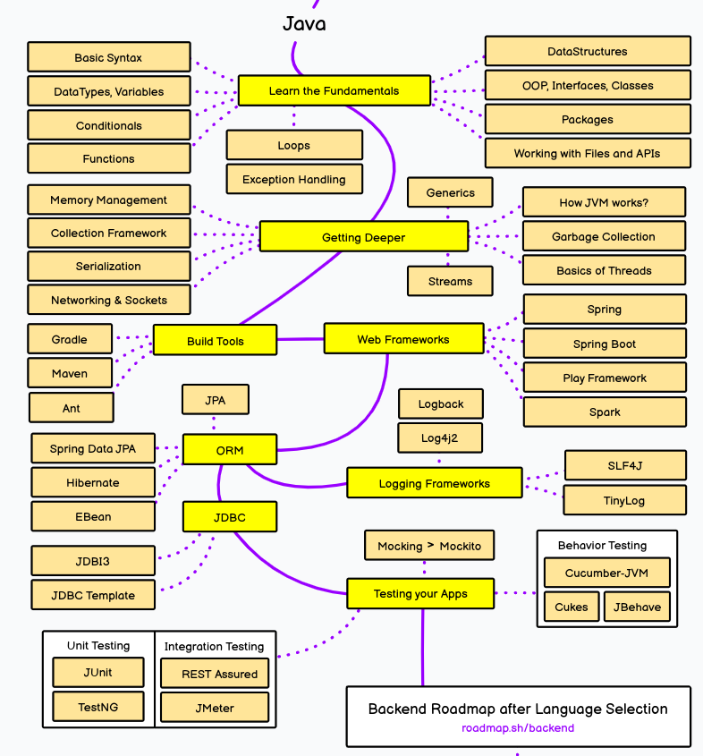
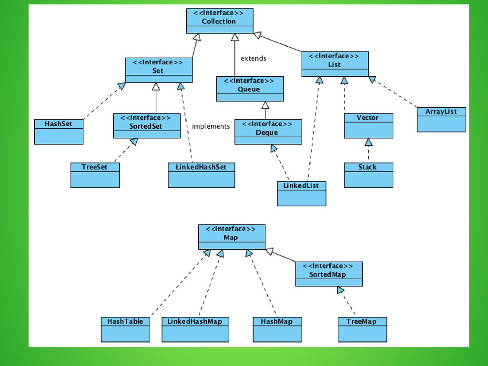

# Учебник по Python

## Оглавление
1. [Roadmap](#road-map)
1. [Введение в Java](#introduction-to-Java)
    1. [База](#base)
    1. [Классы](#classes)
    1. [Аннотации](#annotation)
1. [Логирование](#logging)
1. [Docker: приложение в коробке]()
1. [Оптимизация и мониторинг docker-образов. DockerHub]()
1. [Факты](#facts)
1. [Полезные ресурсы](#res)
1. [Проекты](#project)

# Roadmap 

# Введение в Java  

Java - строго типизированный объектно-ориентированный язык программирования
общего назначения, разработанный компанией Sun Microsystems (в последующем
приобретённой компанией Oracle). Разработка ведётся сообществом, организованным
через Java Community Process; язык и основные реализующие его технологии
распространяются по лицензии GPL. Права на торговую марку принадлежат корпорации
Oracle.

Приложения Java обычно транслируются в специальный байт-код, поэтому они могут
работать на любой компьютерной архитектуре, для которой существует реализация
виртуальной Java-машины.

## База 

Для того чтобы считать информацию используется класс **Scanner**:

~~~
import java.util.Scanner;

Scanner scan = new Scanner(System.in);
a = scan.nextInt();

System.out.println("A:" + a);
~~~

**Типы данных:** 
1) целые числа (byte, short, int, long);
2) числа с плавающей точкой (float, double);
3) логический (boolean);
4) символьный (char).

**Логические операции:**
1) ! — оператор отрицания;
2) && — оператор логическое И (сокращенный);
3) || — оператор логическое ИЛИ (сокращенный);
4) & — оператор побитовое И;
5) | — оператор побитовое ИЛИ;
6) ^ — оператор побитовое исключающее ИЛИ.

**Условные конструкции:** if: 
~~~
if (5<3) {
   System.out.println(5);
}
else {
   System.out.println(3);
}
~~~

**Тернарный оператор:**
~~~
(a >= 18) ? a : 18;
~~~

**swich:**

Для его использования объекты должны быть константами.
~~~
int a1 = 1;
final int a2 = 2;
final int a3 = 1;

switch (a1) {
   case a2:
         System.out.printf("Hello and welcome!\n");
         break;
   case a3:
         System.out.printf("Hello!\n");
         break;
}
~~~

**Циклы:**

~~~
for (int i = 1; i < 9; i++) {
	// тело цикла
    System.out.printf("Квадрат числа %d равен %d \n", i, i * i);
}

int j = 1;
do { // начинаем цикл
   System.out.printf("Квадрат числа %d равен %d \n", i, i * i);
   j++;
}
while (j < 9); // проверяем условие цикла

while (k < 10){
	System.out.printf("Квадрат числа %d равен %d \n", k, k * k);
   k++;
}
~~~

**Массивы**

Одномерные массивы:
~~~
int[] a = new int[5] {1, 2, 3, 4, 5}
~~~

Двумерные массивы:
~~~
int[][] a = new int[2][2] {{1, 2}, {1, 3}};
~~~

**Коллекции**

Пример использования:

~~~
import java.utils.ArrayList;

ArrayList<Integer> b = new ArrayList<>();
b.add(5);
b.add(2);
System.out.println(b.get(0));

for(Integer i : b){
   System.out.println(i);
}
~~~

**Функции** 

Тк в java все является классами, то нет как таковых функций вне классов, есть
только методы.

Пример:
~~~
public static int test() {
   return 5;
}
~~~

## Классы 

**Модификаторы доступа**
- public - данный класс, поле или метод доступен из других классво или методов.

- protected - данная сущность будет доступна только внутри данного класса или
  класса наследника.

- private - данная сущность будет видна / доступна только внутри данного класса.

Пример создания классов и наследования:
~~~
public class Test_class {
    public int a;
    public int b;

    protected int z = 1212;
    public Test_class(int a, int b){
        this.a = a;
        this.b = b;
    }
}

public class Test_chaild extends Test_class {
    public int c;

    public Test_chaild(int a, int b, int c) {
        super(a, b);
        this.c = c;
    }
}

public class Test_chaild_chaild extends Test_chaild {
    public Test_chaild_chaild(int a, int b, int c) {
        super(a, b, c);
        System.out.println(this.z);
    }
}
~~~

Чтобы переписать метод другого класса используется аннотация @Override, а чтобы
вызвать такой же метод у родителя supet.method():

~~~
public class Test_chaild extends Test_class {
    public int c;

    public Test_chaild(int a, int b, int c) {
        super(a, b);
        this.c = c;
    }
    public void test() {
        System.out.println("test_child");
    }
}

public class Test_chaild_chaild extends Test_chaild {
    public Test_chaild_chaild(int a, int b, int c) {
        super(a, b, c);
        System.out.println(this.z);
    }
    @Override
    public void test() {
        super.test();
        System.out.println("test_child_child");
    }
}
~~~

**Абстрактные классы**

Абстрактные классы - классы объекты, которых никогда не будут создаваться, те
они нужны для того, чтобы на их основе написать потомков. 

Такая же концепция используется и для абстрактных методов. Если мы в классе
потомке не реализуем данный метод, то у нас появится ошибка.

Чтобы сделать класс абстрактным нужно написать:

~~~
public abstract class Test_class {
    public int a;
    
    public Test_class(int a){
        this.a = a;
    }

    public abstract test(int a);
}
~~~

**Вложенные классы**

Вложенный класс ничем не отличается от обычного, за исключеним того, что
находится внутри другого класса.

~~~
public  class Test_class {
    public int a = 5;

    public Test_in_test{
        public int b = 3;
    }
}
~~~

**Анонимные классы**

Анонимные классы - это классы, которые будут созданы всего один раз, поэтому
создавать для них объект - нет смылса. 

Допустим у нас есть класс Car, и мы хотим сделать объект fly Car.
~~~
Car flyCar = new Car(...) { 
   @0verride
   public void move0bject(float speed) {
      super.move0bject(speed);
      System.out.println("Машина летит");
   }
};
~~~

# Аннотации 

Аннотации в Java являются своего рода метками в коде, описывающими метаданные
для функции/класса/пакета. Например, всем известная Аннотация @Override,
обозначающая, что мы собираемся переопределить метод родительского класса. Да, с
одной стороны, можно и без неё, но если у родителей не окажется этого метода,
существует вероятность, что мы зря писали код, т.к. конкретно этот метод может и
не вызваться никогда, а с Аннотацией @Override компилятор нам скажет, что: "Я не
нашел такого метода в родителях... что-то здесь нечисто".

Каждая из аннотаций имеет 2 главных обязательных параметра: 

- Тип хранения (Retention);
- Тип объекта над которым она указывается (Target).

Под "типом хранения" понимается стадия до которой "доживает" наша аннотация
внутри класса. Каждая аннотация имеет только один из возможных "типов хранения"
указанный в классе RetentionPolicy:

- SOURCE - аннотация используется только при написании кода и игнорируется
  компилятором (т.е. не сохраняется после компиляции). Обычно используется для
  каких-либо препроцессоров (условно), либо указаний компилятору

- CLASS - аннотация сохраняется после компиляции, однако игнорируется JVM (т.е.
  не может быть использована во время выполнения). Обычно используется для
  каких-либо сторонних сервисов, подгружающих ваш код в качестве plug-in
  приложения

- RUNTIME - аннотация которая сохраняется после компиляции и подгружается JVM
  (т.е. может использоваться во время выполнения самой программы). Используется
  в качестве меток в коде, которые напрямую влияют на ход выполнения программы
  (пример будет рассмотрен в данной статье)

**Тип объекта над которым указывается**

Данное описание стоит понимать практически буквально, т.к. в Java аннотации
могут указываться над чем угодно (Поля, классы, функции, т.д.) и для каждой
аннотации указывается, над чем конкретно она может быть задана. Здесь уже нет
правила "что-то одно", аннотацию можно указывать над всем ниже перечисленным,
либо же выбрать только нужные элементы класса ElementType:

- ANNOTATION_TYPE - другая аннотация
- CONSTRUCTOR - конструктор класса
- FIELD - поле класса
- LOCAL_VARIABLE - локальная переменная
- METHOD - метод класса
- PACKAGE - описание пакета package
- PARAMETER - параметр метода public void hello(@Annontation String param){}
- TYPE - указывается над классом

1) ~~~
   @Override
   Retention: SOURCE;
   Target: METHOD.

   Данная аннотация показывает, что метод над котором она прописана наследован у родительского класса.
   ~~~
2) ~~~
   @Deprecated
   Retention: Runtime;
   Target: CONSTRUCTOR, FIELD, LOCAL_VARIABLE, METHOD, PACKAGE, PARAMETER, TYPE.

   Данная аннотация указывает на методы, классы или переменные, которые является "устаревшими" и могут быть убраны в последующих версиях продукта.
   ~~~
3) ~~~
   @SuppressWarnings
   Retention: SOURCE;
   Target: TYPE, FIELD, METHOD, PARAMETER, CONSTRUCTOR, LOCAL_VARIABLE

   Данная аннотация отключает вывод предупреждений компилятора, которые касаются элемента над которым она указана. Является SOURCE аннотацией указываемой над полями, методами, классами.
   ~~~
4) ~~~
   @Retention
   Retention: RUNTIME;
   Target: ANNOTATION_TYPE;

   Данная аннотация задает "тип хранения" аннотации над которой она указана. Да эта аннотация используется даже для самой себя... магия да и только.
   ~~~
5) ~~~
   @Target
   Retention: RUNTIME;
   Target: ANNOTATION_TYPE;

   Данная аннотация задает тип объекта над которым может указываться создаваемая нами аннотация. Да и она тоже используется для себя же, привыкайте...
   ~~~

# Факты 

Чтобы стравнить две строки нужно использовать не == , а метод equals()

~~~
if (a.equals("Привет") {
   "Привет"
}
else {
   "Пока"
}
~~~

**При наследвание сын может обращаться к protected полям бабушки.**

# Полезные ресурсы 

Литература: 

Ресурсы:

1. [Песочница для запуска кода](https://replit.com/languages/python3)

1. [Песочница для работы с
   гитом](https://learngitbranching.js.org/?locale=ru_RU)

1. [Лекции от школы
   бэкенда](https://www.youtube.com/watch?v=PxIqLgjtQ5Y&list=PLQC2_0cDcSKBHamFYA6ncnc_fYuEQUy0s&index=2)

1. [Установка и базовые консольные команды PostgreSql для
   Linux](https://www.youtube.com/watch?v=kWUW3sMK0Mk)

1. [Официальный сайт SqlAlchemy](https://docs.sqlalchemy.org/en/20/)

# Проекты 

