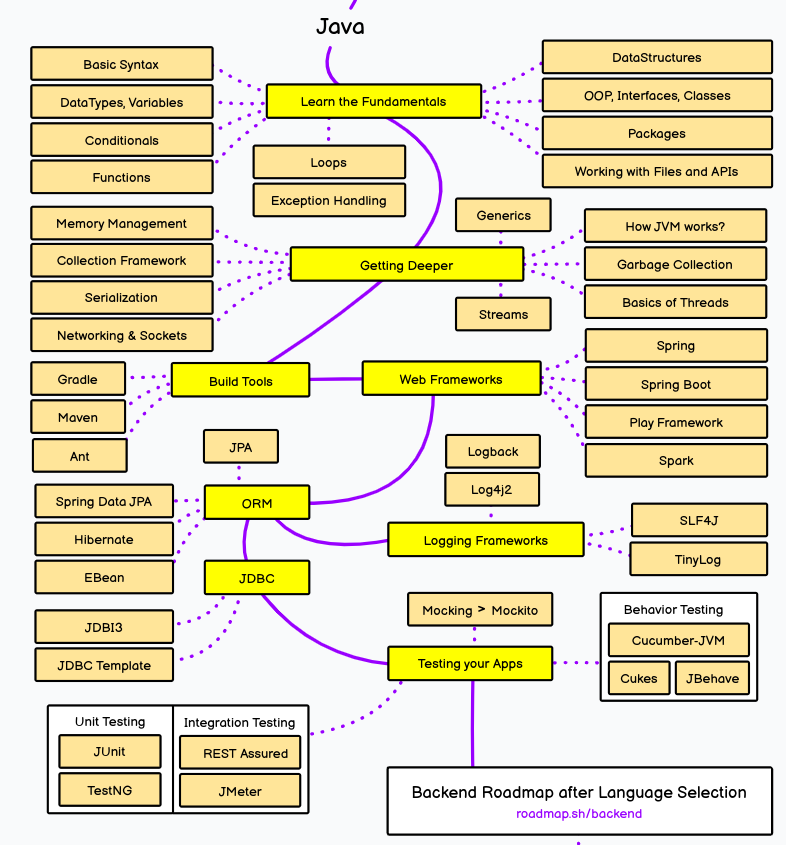
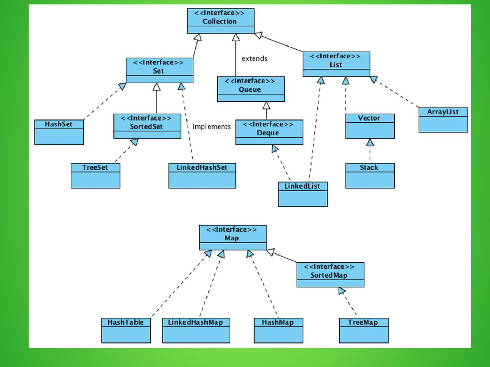
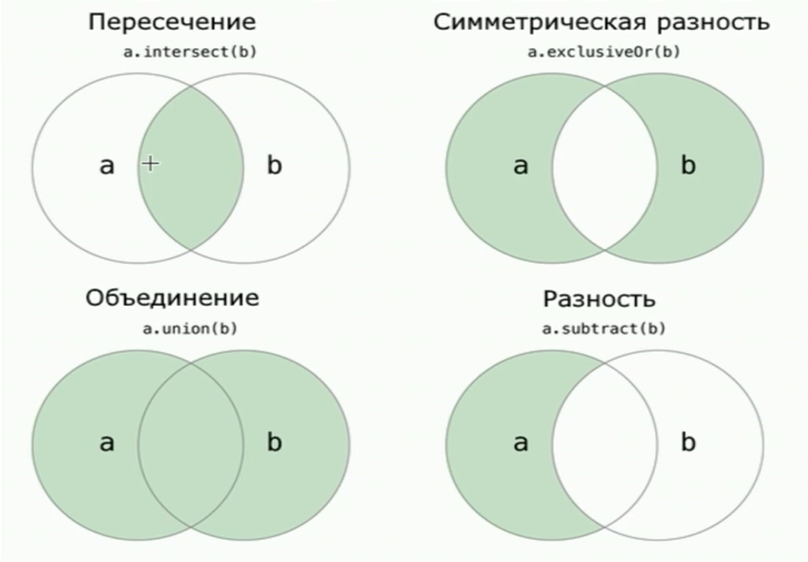
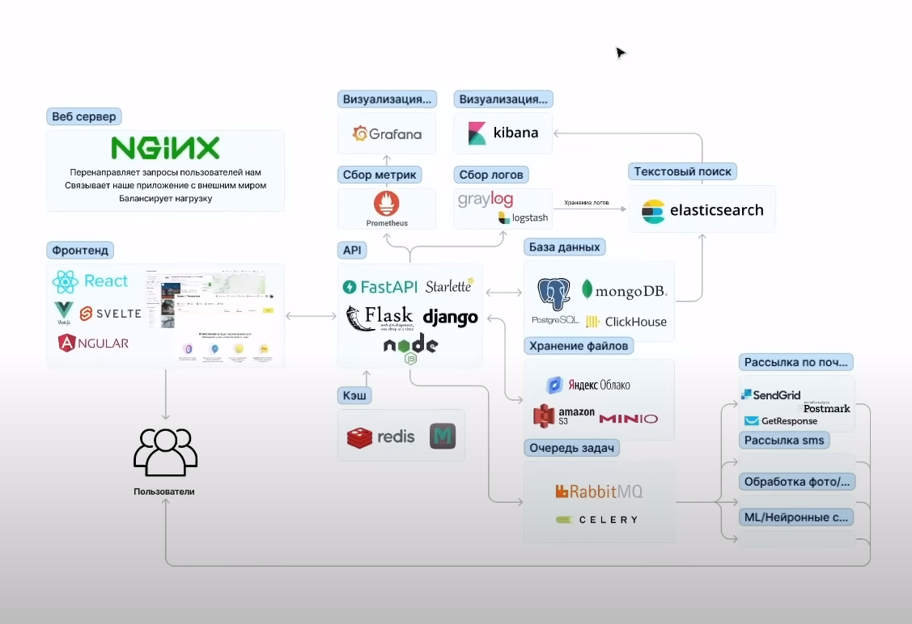

# Учебник по JAVA

## Оглавление
1. [Roadmap](#road-map)
1. [Введение в Java](#introduction-to-Java)
    1. [База](#base)
    1. [Коллекции](#collection)
        1. [ArrayList](#arraylist)
        1. [LinkedList](#linkedlist)
        1. [Map](#map)
        1. [Set](#set)
        1. [Контракт hashCode() и equals()](#hseq)
        1. [Компаратор](#comparator)
        1. [Итераторы](#Iterable)
    1. [Классы](#classes)
    1. [Аннотации](#annotation)
    1. [Исключения](#exeption)
    1. [Generics](#generics)
    1. [Optional](#optional)
    1. [Лямбда](#lamda)
    1. [Streams](#streams)
    1. [Операции над stream](#operation-of-stream)
    1. [Регулярные выражения](#regular)
        1. [Классы Pattern и Matcher](#PatMat)
1. [Deep Java](/Java/Deep-Java.md)
1. [Maven](/Java/Maven.md)
1. [JUnit](/Java/JUnit.md)
1. [Docker: приложение в коробке]()
1. [Оптимизация и мониторинг docker-образов. DockerHub]()
1. [Факты](#facts)
1. [Полезные ресурсы](#res)
1. [Проекты](#project)

# Roadmap 

# Введение в Java  

Java - строго типизированный объектно-ориентированный язык программирования
общего назначения, разработанный компанией Sun Microsystems (в последующем
приобретённой компанией Oracle). Разработка ведётся сообществом, организованным
через Java Community Process; язык и основные реализующие его технологии
распространяются по лицензии GPL. Права на торговую марку принадлежат корпорации
Oracle.

Приложения Java обычно транслируются в специальный байт-код, поэтому они могут
работать на любой компьютерной архитектуре, для которой существует реализация
виртуальной Java-машины.

## База 

Для того чтобы считать информацию используется класс **Scanner**:

~~~
import java.util.Scanner;

Scanner scan = new Scanner(System.in);
a = scan.nextInt();

System.out.println("A:" + a);
~~~

**Типы данных:** 
1) целые числа (byte, short, int, long);
2) числа с плавающей точкой (float, double);
3) логический (boolean);
4) символьный (char).

**Логические операции:**
1) ! — оператор отрицания;
2) && — оператор логическое И (сокращенный);
3) || — оператор логическое ИЛИ (сокращенный);
4) & — оператор побитовое И;
5) | — оператор побитовое ИЛИ;
6) ^ — оператор побитовое исключающее ИЛИ.

**Условные конструкции:** if: 
~~~
if (5<3) {
   System.out.println(5);
}
else {
   System.out.println(3);
}
~~~

**Тернарный оператор:**
~~~
(a >= 18) ? a : 18;
~~~

**swich:**

Для его использования объекты должны быть константами.
~~~
int a1 = 1;
final int a2 = 2;
final int a3 = 1;

switch (a1) {
   case a2:
         System.out.printf("Hello and welcome!\n");
         break;
   case a3:
         System.out.printf("Hello!\n");
         break;
}
~~~

**Циклы:**

~~~
for (int i = 1; i < 9; i++) {
	// тело цикла
    System.out.printf("Квадрат числа %d равен %d \n", i, i * i);
}

int j = 1;
do { // начинаем цикл
   System.out.printf("Квадрат числа %d равен %d \n", i, i * i);
   j++;
}
while (j < 9); // проверяем условие цикла

while (k < 10){
	System.out.printf("Квадрат числа %d равен %d \n", k, k * k);
   k++;
}
~~~

**Массивы**

Одномерные массивы:
~~~
int[] a = new int[5] {1, 2, 3, 4, 5}
~~~

Двумерные массивы:
~~~
int[][] a = new int[2][2] {{1, 2}, {1, 3}};
~~~

## Коллекции 

Пример использования:

~~~
import java.utils.ArrayList;

ArrayList<Integer> b = new ArrayList<>();
b.add(5);
b.add(2);
System.out.println(b.get(0));

for(Integer i : b){
   System.out.println(i);
}
~~~

### ArrayList 

Работает как vector в c++, добавляет новый элемент в конец, когда память
заполняется то она увеличивается вдвое.

Основные операции:

- add(E e) - добавляет элемент в конец списка.
- remove(int index) - удаляет элемент из списка по индексу.
- get(int index) - возвращает элемент из списка по индексу.

### LinkedList 

Двусвязанный список. Позволяет обратиться к элементам по индексу, при этом
удаление или добавление в рандомное место происходит за O(1). Обращение по
индексу происходит больше чем O(1).

Основные операции:

- add(E e) - добавляет элемент в конец списка.
- remove(int index) - удаляет элемент из списка по индексу.
- get(int index) - возвращает элемент из списка по индексу.

### Map 

Коллекция содержацая наборы ключ - значение.

Основные операции:

- put(1, "Один") - добавление элемента.
- get(1) - получение значения по ключу.

Для хранения пар используется Interface Map.Entry < K , V >, благодаря этому map
возможно обойти следующим образом.

~~~
for (Map.Entry<Integer, String> entry: map.entrySet()){
    System.out.println (entry.getKey() + entry.getValue());
}
~~~

**HashMap** - не гарантирует никакого порядка пар внутри структуры данных.
**LinkedHashMap** - отстортирован в порядке добавления пар (естественный
порядок). **TreeMap** - пары отстортированы по ключу.

### Set 

Коллекция содержащая только уникальные элементы.

Основные операции:

- add - добавляет элемент.
- contains - проверка, есть ли элемент в коллекции.
- remove - удаляет элемент.

 

**HashSet** - не гарантирует никакого порядка пар внутри структуры данных.
**LinkedHashSet** - отстортирован в порядке добавления пар (естественный
порядок). **TreeSet** - пары отстортированы по возрастанию.

**Внутри hashSet лежит просто hashMap без значений, а только ключей**

### Контракт hashCode() и equals() 

1. Два элемента проверяются на равенство с помощью hashCode() -> если объекты не
   равны нас это устраивает.

2. Если объекты равны, то их следует проверить с помощью equals.

3. Метод equals всегда выдает верный ответ, но работает дольше hashCode.

По умоланию метод equals() у элемента Object - сравнивает ссылки на участки
памяти.

Метод **`equals()`** является методом класса **`Object`** в Java и используется
для сравнения объектов на равенство. Метод имеет сигнатуру `**public boolean
equals(Object o)`.**

Метод **`hashCode()`** также является методом класса **`Object`** и используется
для вычисления и возвращения целочисленного хэш-кода объекта. Хэш-код — это
числовое значение, которое представляет состояние объекта и используется для
оптимизации поиска и сравнения объектов в хэш-таблицах и коллекциях. Сигнатура:
`**public int hashCode()**`.

**Контракт `equals()`**

Используя `**equals**`, мы должны придерживаться основных правил, определённых в
спецификации Java:

1. **Сравнение null** — `**x.equals(null)**` возвращает `**false**`.
2. **Рефлексивность** — `**x.equals(x)**` возвращает `**true**`.
3. **Симметричность** — `**x.equals(y) <=> y.equals(x)**`.
4. **Транзитивность** — `**x.equals(y) && y.equals(z) => x.equals(z)**`.
5. **Согласованность** — повторный вызов `**x.equals(y)**` должен возвращать
   значение предыдущего вызова, если сравниваемые поля не изменялись.

**Контракт `hashCode()`**

1. Повторный вызов **`hashCode()`** для одного и того же объекта должен
   возвращать одинаковые хэш-значения, если поля объекта, участвующие в
   вычислении значения, не менялись.
2. Если `**equals()**` для двух объектов возвращает `**true**`, `**hashCode()**`
   также должен возвращать для них одно и то же число.
3. При этом неравные между собой объекты могут иметь одинаковый хэш-код
   **(коллизия)**.

### Компаратор 

Интерфейс Comparator помогает переопределить сравнение элементов для изменения
порядка их сортировки.

~~~
Class  StringLenComp implement Comporator<String>{
    @Override
    public int compare(String o1, String o2){
        if (o1.length()> o2.length())
            return 1;
        else 
            return -1;
    }
}
~~~

Интерфейс comparable у класса говорит, что его элементы сравнимы.

Правила сравнения описываются в функции compareTo:

~~~
@Override
publick int compareTo(Person p) {
    if (this.id > p.id)
        return 1;
    else
        return 0;
}
~~~

### Обход коллекций (Iterable) 

Существует два варианта обхода

1. Цикл foreach

~~~
for (int x: list)
    System.out.println(x);
~~~

В данном случае мы лишины возможности удалять элементы во время обхода.

2. Создание iterator

Важно помнить, что итератор указывает на область перед первым элементом
коллекции.

~~~

Iterator<Integer> iter = list.iterator();

while(iter.hasNext()){
    iter.remove(); // позволяет удалить элемент во время обхода

    System.out.println(iter.next());
}
~~~

**Функции** 

Тк в java все является классами, то нет как таковых функций вне классов, есть
только методы.

Пример:
~~~
public static int test() {
   return 5;
}
~~~

## Классы 

**Модификаторы доступа**
- public - данный класс, поле или метод доступен из других классво или методов.

- protected - данная сущность будет доступна только внутри данного класса или
  класса наследника.

- private - данная сущность будет видна / доступна только внутри данного класса.

Пример создания классов и наследования:
~~~
public class Test_class {
    public int a;
    public int b;

    protected int z = 1212;
    public Test_class(int a, int b){
        this.a = a;
        this.b = b;
    }
}

public class Test_chaild extends Test_class {
    public int c;

    public Test_chaild(int a, int b, int c) {
        super(a, b);
        this.c = c;
    }
}

public class Test_chaild_chaild extends Test_chaild {
    public Test_chaild_chaild(int a, int b, int c) {
        super(a, b, c);
        System.out.println(this.z);
    }
}
~~~

Чтобы переписать метод другого класса используется аннотация @Override, а чтобы
вызвать такой же метод у родителя supet.method():

~~~
public class Test_chaild extends Test_class {
    public int c;

    public Test_chaild(int a, int b, int c) {
        super(a, b);
        this.c = c;
    }
    public void test() {
        System.out.println("test_child");
    }
}

public class Test_chaild_chaild extends Test_chaild {
    public Test_chaild_chaild(int a, int b, int c) {
        super(a, b, c);
        System.out.println(this.z);
    }
    @Override
    public void test() {
        super.test();
        System.out.println("test_child_child");
    }
}
~~~

**Абстрактные классы**

Абстрактные классы - классы объекты, которых никогда не будут создаваться, те
они нужны для того, чтобы на их основе написать потомков. 

Такая же концепция используется и для абстрактных методов. Если мы в классе
потомке не реализуем данный метод, то у нас появится ошибка.

Чтобы сделать класс абстрактным нужно написать:

~~~
public abstract class Test_class {
    public int a;
    
    public Test_class(int a){
        this.a = a;
    }

    public abstract test(int a);
}
~~~

**Вложенные классы**

Вложенный класс ничем не отличается от обычного, за исключеним того, что
находится внутри другого класса.

~~~
public  class Test_class {
    public int a = 5;

    public Test_in_test{
        public int b = 3;
    }
}
~~~

**Анонимные классы**

Анонимные классы - это классы, которые будут созданы всего один раз, поэтому
создавать для них объект - нет смылса. 

Допустим у нас есть класс Car, и мы хотим сделать объект fly Car.
~~~
Car flyCar = new Car(...) { 
   @0verride
   public void move0bject(float speed) {
      super.move0bject(speed);
      System.out.println("Машина летит");
   }
};
~~~

**Static** Статичные поля или методы - это такие поля или методы, которые не
принадлежат конкретной сущности, а являются общими для всего класса.

Внутри статичных методов можно работать только со статичными полями и методами.
~~~

public class Test {
   public static a;
}

Test new_test = new Test();
new_test.a = 5; // error

Test.a = 5;
~~~

**Final**

При указание **final** к переменной - она становится константой.

При указание модификатора доступа **final** к методу, данный метод становится не
переопределяемым.

При указание **final** к классу - он больше не может иметь потомков.

**Interface**

Своего рода абстрактный класс, в котором мы только указываем методы без их
реализации. Поля внутри интерфейся являются константами и переопределить иили
изменить их не получится.

**Наследование интерфейсов** 

Интерфейс может наследоваться только от интерфейсов. Зато родителей у интерфейса
может быть много. Еще говорят, что в Java есть множественное наследование
интерфейсов.

Класс может наследоваться от нескольких интерфейсов (и только от одного класса).
При этом используется ключевое слово implements. 

~~~
public class Test_class implements for_Test {
    public int a = 5;

    @Override
    public void set(int a) {
        this.a = a;
    }

    @Override
    public int get() {
        return this.a;
    }
}

public intarface for_Test {
   public void set(int a);
   public int get();
}
~~~

# Аннотации 

Аннотации в Java являются своего рода метками в коде, описывающими метаданные
для функции/класса/пакета. Например, всем известная Аннотация @Override,
обозначающая, что мы собираемся переопределить метод родительского класса. Да, с
одной стороны, можно и без неё, но если у родителей не окажется этого метода,
существует вероятность, что мы зря писали код, т.к. конкретно этот метод может и
не вызваться никогда, а с Аннотацией @Override компилятор нам скажет, что: "Я не
нашел такого метода в родителях... что-то здесь нечисто".

Каждая из аннотаций имеет 2 главных обязательных параметра: 

- Тип хранения (Retention);
- Тип объекта над которым она указывается (Target).

Под "типом хранения" понимается стадия до которой "доживает" наша аннотация
внутри класса. Каждая аннотация имеет только один из возможных "типов хранения"
указанный в классе RetentionPolicy:

- SOURCE - аннотация используется только при написании кода и игнорируется
  компилятором (т.е. не сохраняется после компиляции). Обычно используется для
  каких-либо препроцессоров (условно), либо указаний компилятору

- CLASS - аннотация сохраняется после компиляции, однако игнорируется JVM (т.е.
  не может быть использована во время выполнения). Обычно используется для
  каких-либо сторонних сервисов, подгружающих ваш код в качестве plug-in
  приложения

- RUNTIME - аннотация которая сохраняется после компиляции и подгружается JVM
  (т.е. может использоваться во время выполнения самой программы). Используется
  в качестве меток в коде, которые напрямую влияют на ход выполнения программы
  (пример будет рассмотрен в данной статье)

**Тип объекта над которым указывается**

Данное описание стоит понимать практически буквально, т.к. в Java аннотации
могут указываться над чем угодно (Поля, классы, функции, т.д.) и для каждой
аннотации указывается, над чем конкретно она может быть задана. Здесь уже нет
правила "что-то одно", аннотацию можно указывать над всем ниже перечисленным,
либо же выбрать только нужные элементы класса ElementType:

- ANNOTATION_TYPE - другая аннотация
- CONSTRUCTOR - конструктор класса
- FIELD - поле класса
- LOCAL_VARIABLE - локальная переменная
- METHOD - метод класса
- PACKAGE - описание пакета package
- PARAMETER - параметр метода public void hello(@Annontation String param){}
- TYPE - указывается над классом

1) ~~~
   @Override
   Retention: SOURCE;
   Target: METHOD.

   Данная аннотация показывает, что метод над котором она прописана наследован у родительского класса.
   ~~~
2) ~~~
   @Deprecated
   Retention: Runtime;
   Target: CONSTRUCTOR, FIELD, LOCAL_VARIABLE, METHOD, PACKAGE, PARAMETER, TYPE.

   Данная аннотация указывает на методы, классы или переменные, которые является "устаревшими" и могут быть убраны в последующих версиях продукта.
   ~~~
3) ~~~
   @SuppressWarnings
   Retention: SOURCE;
   Target: TYPE, FIELD, METHOD, PARAMETER, CONSTRUCTOR, LOCAL_VARIABLE

   Данная аннотация отключает вывод предупреждений компилятора, которые касаются элемента над которым она указана. Является SOURCE аннотацией указываемой над полями, методами, классами.
   ~~~
4) ~~~
   @Retention
   Retention: RUNTIME;
   Target: ANNOTATION_TYPE;

   Данная аннотация задает "тип хранения" аннотации над которой она указана. Да эта аннотация используется даже для самой себя... магия да и только.
   ~~~
5) ~~~
   @Target
   Retention: RUNTIME;
   Target: ANNOTATION_TYPE;

   Данная аннотация задает тип объекта над которым может указываться создаваемая нами аннотация. Да и она тоже используется для себя же, привыкайте...
   ~~~

## Исключеня 

Обработка исключений в Java основана на использовании в программе следующих
ключевых слов:

- try – определяет блок кода, в котором может произойти исключение;
- catch – определяет блок кода, в котором происходит обработка исключения;
- finally – определяет блок кода, который является необязательным, но при его
  наличии выполняется в любом случае независимо от результатов выполнения блока
  try.
- throw – используется для возбуждения исключения;
- throws – используется в сигнатуре методов для предупреждения, о том что метод
  может выбросить исключение.

~~~
public String input() throws MyException {
      BufferedReader reader = new BufferedReader(new InputStreamReader(System.in));
    String s = null;

    try {
        s = reader.readLine();
    } catch (IOException e) {
        System.out.println(e.getMessage());
    } finally {
        try {
            reader.close();
        } catch (IOException e) {
            System.out.println(e.getMessage());
        }
    }

    if (s.equals("")) {
        throw new MyException("String can not be empty!");
    }
    return s;
}
~~~

## Generics 

Дженерики (обобщения) — это особые средства языка Java для реализации
обобщённого программирования: особого подхода к описанию данных и алгоритмов,
позволяющего работать с различными типами данных без изменения их описания.

~~~
class Test<T, U>
{
    T obj1; 
    U obj2; 
 
    Test(T obj1, U obj2)
    {
        this.obj1 = obj1;
        this.obj2 = obj2;
    }
 
    public void print()
    {
        System.out.println(obj1);
        System.out.println(obj2);
    }
}

class Main
{
    public static void main (String[] args)
    {
        Test <String, Integer> obj =
            new Test<String, Integer>("GfG", 15);
 
        obj.print();
    }
}
~~~

## Optional 

Optional - это объект-контейнер, который может содержать или не содержать
нулевое значение. Ссылка на объект класса Optional может быть null Если значение
присутствует, метод isPresent() вернет true.

Позволяет избавиться от проверки на null Без этого класса приходилось писать
проверку на NullPointerException. Благодарю этому один объект Optional можно
сравнить с другим объектом Optional через метод equals(), даже если они хранят в
себе ссылки на null.

Получить элемент Optional get() Метод класса Optoinal – возвращает значение,
если оно присутствует, в противном случае бросит NoSuchElementException.

## Лямбда 

Именно интерфейсы с одним единственным методом и подходят для использования
лямбда-выражениями (неименнованная функция). Как я уже говорил выше,
лямбда-выражение — это метод, завернутый в объект. И когда мы передаем куда-то
такой объект — мы, по сути, передаем этот один единственный метод. Получается,
нам не важно, как этот метод называется. Все, что нам важно — это параметры,
которые этот метод принимает, и, собственно, сам код метода.

Лямбда-выражение — это, по сути реализация функционального интерфейса, где видим
интерфейс с одним методом — значит, такой анонимный класс можем переписать через
лямбду. Если в интерфейсе больше/меньше одного метода — тогда нам
лямбда-выражение не подойдет, и будем использовать анонимный класс, или даже
обычный.

Область видимости лямбда выражения - область где она была создана. Своей области
видимости у нее нет.

~~~
(параметры) -> {тело метода}

() -> ""

() -> 42

() -> {
    String[] helloWorld = {"Hello", "world!"};
    System.out.println(helloWorld[0]);
    System.out.println(helloWorld[1]);
}

(x, y) -> x % y
~~~

## Streams 

Самые популярные операции:

- map() - меняет каждый элемент по указанному методу.
- filter() - фильтрует поток по указанному методу.
- forEach() - применяет методо к каждому элементу в потоке.
- reduce((accum, now) -> accum + now) - сокращает поток до одного элемента
  используя аккомулятор. 

С выходом Java 8 появилась поддержка функционального программирования. Стало
возможным конструировать сложные цепочки операций над потоком данных.

Stream API – по сути это поток данных и последовательные операции над ними.

Интерфейсы Stream, IntStream, LongStream и DoubleStream – это потоки объектов и
примитивных типов int, long и double.

Интерфейс Stream представляет собой последовательность элементов, поддерживающих
последовательные и параллельные агрегатные операции.

~~~
public interface Stream<T> extends BaseStream<T,Stream<T>>
~~~

К агрегатным операциям относят различные операции над выборкой, например,
получение числа элементов, получение минимального, максимального и среднего
значения в выборке, а также суммирование значений.

Stream не предоставляет средств для прямого доступа к элементам или
манипулирования ими. Вместо этого он описывает источник данных и вычислительные
операции, которые будут выполняться над этими данными.

Чтобы обеспечить способ работы с тремя наиболее часто используемыми типами
примитивов – int, long и double – библиотека java.util.stream включает три
реализации стрима примитивов:

~~~
IntStreaam int_Str = IntStream.of(1, 2, 3, 4);
DoubleStreaam double_Str = DoubleStream.of(1, 2, 3, 4);

IntStream.range(1, 10);
DobuleStream.range(1.0, 10.0);
~~~

Создание потока примитивных типов mapToInt(), mapToDouble(), mapToLong():
~~~
List<Integer> numbers = new ArrayList<>();

numbers.stream().mapToInt(value -> value);

numbers.stream().mapToDouble(value -> value);
        
numbers.stream().mapToLong(value -> value);
~~~

Стримы примитивных типов данных имеют ряд уникальных методов, например диапазон
и сумма всех элементов потока.

~~~
range(int startInclusive, int endExclusive)
sum()
~~~

Поток элементов может быть получен разными способами, например:

~~~
List<String> list = new ArrayList<>();
list.stream();
list.parallelStream();           // параллельный поток
~~~

~~~
Map<String, String> map = new HashMap<>();
map.entrySet().stream();
map.values().stream();
~~~

Stream из элементов, используя статические методы Классов-потоков:
~~~
Stream.of("a", "b", "c");        // поток из элементов

Stream.of(array);                // поток из элементов массива

Stream.of(list);                 // поток из элементов списка List

Stream.generate(Math::random);   // генерация потока рандомных чисел

Stream.concat(stream1, stream2); // объединяет два потока в один

IntStream.range(1, 10);          // поток диапазона чисел от 1 до 9

IntStream.rangeClosed(1, 10);    // поток диапазона чисел от 1 до 10
~~~

## Операции над Stream 

Операции над потоком элементов бывают:

Intermediate – Промежуточные Не меняют данные, а только задают логику их
изменения. С их помощью можно составить последовательную цепь операций над
элементами.

- Terminal – Конечные Запускают всю цепь промежуточных операций, закрывают поток
и возвращают модифицированные данные.

- Промежуточные операции НЕ выполняются без терминальных. После обработки стрим
нельзя повторно использовать.

Операции над потоком могут выполняться как последовательно, так и параллельно.
Чтобы превратить обычный стрим в параллельный, нужно вызвать промежуточный
оператор parallel()

~~~
Stream<String> stream = list.stream();

stream.parallel();
~~~

**Промежуточные операции. Intermediate**

Данные операции удобно воспринимать как отложенные – они выполнятся, когда их
запустит конечная терминальная операция над стримом.

Провести операцию над каждым элементом peek() Аналог forEach(), только
промежуточный (нетерминальный) Если в метод peek() передать функцию
System.out::println, тогда все объекты будут выводиться на экран в момент, когда
они будут проходить через поток.

~~~
Stream.of("a", "b", "c").peek(System.out::println);
~~~

Преобразовать данные из одного типа в другой map() Можно передать функцию,
которая преобразовывает один тип данных в другой.

~~~
Stream.of(1, 2, 3).map((x) -> String.valueOf(x));

Stream.of(1, 2, 3).map(String::valueOf);        // лямбда выражение

Stream.of("1", "2", "3").map(Integer::parseInt);
~~~

Отфильтровать элементы filter()

~~~
Stream.of(1, 2, 3, 4, 5).filter(n -> n < 4);    // [1, 2, 3]
~~~

Удалить дублирующиеся элементы distinct()

~~~
Stream.of(1, 2, 3, 2, 4, 2, 5).distinct();      // [1, 2, 3, 4, 5]
~~~

Сортировка и обратная сортировка элементов sorted()

~~~
Stream.of(4, 2, 3, 5, 1).sorted();              // [1, 2, 3, 4, 5]

Stream.of(4, 2, 3, 5, 1).sorted(Comparator.reverseOrder())
~~~

Лимит количества элементов limit()

~~~
Stream.of(1, 2, 3, 4, 5, 6).limit(3);            // [1, 2, 3]
~~~

Пропустить первые элементы skip()

~~~
Stream.of(1, 2, 3, 4, 5).skip(2);                // [3, 4, 5]
~~~

Сопоставить поток с развернутым потоком flatMap() Возвращает поток, состоящий из
результатов замены каждого элемента этого потока содержимым сопоставленного
потока, полученного путем применения предоставленной функции сопоставления к
каждому элементу.

Таким образом можно развернуть двухмерный массив:

~~~
Integer[][] array2d = new Integer[][] {
                {1, 2, 3},
                {4, 5}
};

Arrays.stream(array2d).flatMap(Arrays::stream);    // [1, 2, 3, 4, 5]

List<String> petNames = person.stream()
        .flatMap(person -> person.getPetName().stream())
        .collect(Collectors.toList());

System.out.println(petNames);             // [pet1, pet2, pet3, pet4, pet5]
~~~

**Конечные операции. Terminal**

Запускают всю цепь промежуточных операций и возвращают конечный результат,
закрывают поток.

Собрать элементы потока и преобразовать их к нужному типу collect() В аргумент
метода нужно передать объект Collector.

Преобразовать поток в List Collectors.toList()

~~~
List<String> collect = Stream.of("a", "b", "c").collect(Collectors.toList());
~~~

Преобразовать поток в строку String Collectors.joining()

~~~
String collect = Stream.of("a", "b", "c").collect(Collectors.joining());
~~~

Итерация по каждому элементу forEach()

~~~
Stream.of("a", "b", "c").forEach(System.out::println);
~~~

Найти минимальное и максимальное значение min() и max() Сравнение происходит с
помощью объекта Comparator. Возвращают объект класса Optional –
объект-контейнер, который может хранить null. Метод get() –  возвращает
значение, которое хранит объект Optional.

~~~
Optional<Integer> max = Stream.of(4, 2, 3, 5, 1)
        .max(Comparator.naturalOrder());

Integer maximum = max.get();

Integer minimum = Stream.of(4, 2, 3, 5, 1)
        .min(Comparator.naturalOrder())
        .get();
~~~

Найти первый подходящий элемент findFirst() Возвращает первый подходящий элемент
из стрима и завершается. Возвращают объект класса Optional.

~~~
Stream.of(1, 2, 3, 4, 5)
        .filter(e -> e % 2 == 0)
        .findFirst()
        .get();
~~~

Найти любой подходящий элемент findAny() Возвращает любой подходящий элемент из
стрима и завершается. Аналог метода findFirst()для потоков, которые
обрабатываются параллельно. Найденный элемент не обязательно будет первый по
порядку в потоке.

~~~
Stream.of(1, 2, 3, 4, 5, 6, 7, 8, 9, 10)
        .filter(e -> e % 2 == 0)
        .parallel()
        .findAny()
        .get();
~~~

Все элементы соответствуют условию allMatch()

~~~
Stream.of(1, 2, 3, 4, 5).allMatch(e -> e > 0);     // true
~~~

**Операция сведения Stream.reduce()**

Позволяет получить один результат из последовательности элементов, неоднократно
применяя операцию комбинирования к элементам в последовательности.

Участники операции сведения:

- Identity - элемент, который является начальным значением операции сокращения и
  результатом по умолчанию, если поток пуст.

- Accumulator - функция, которая принимает два параметра: частичный результат
  операции сведения и следующий элемент потока

- Combiner - функция, используемая для объединения частичного результата
  операции сокращения и типами реализации аккумулятора. Если используем
  последовательные потоки, типы аргументов аккумулятора и типы его реализации не
  совпадают – нужно использовать Combiner.

~~~
Сумма элементов списка

List<Integer> numbers = Arrays.asList(1, 2, 3, 4, 5, 6);

int sum = numbers.stream()
        .reduce(0, Integer::sum);

int sum2 = numbers.stream()
        .reduce(0, (subtotal, element) -> subtotal + element);
~~~

## Регулярные выражения 

Когда мы хотим использовать специальные символы как обычные мы пишем \\ перед
ними и наоборот.

1. \ \d - одна цифра, \ \ w - одна английская буква, к этому можно добавить:
    1. \+ - это будет значить 1 или  больше. 
    1. \* - 0 или больше, .
    1. \? - 0 или 1 указанный символ до.
    Пример:
    ~~~
    "123342" = "\\d+"
    "a" = "a\\d*"
    "12342" = "-?\\d+"
    "-121223" = "-?\\d+"
    ~~~
1. ( | | | и тд) - служат для обозначения множетсва, где | - разделяет   возможные варианты.
    Пример:
    ~~~
    "12342" = "(-|\\+)?\\d+"
    "-121223" = "(-|\\+)?\\d+"
    "+121223" = "(-|\\+)?\\d+"
    ~~~

1.  Обозначения группы:
    1.[a-zA-Z] - перечисление всех символов алфавита
    1. [абв] - любой из перечисленных (а,б, или в)
    1. [^абв] - любой, кроме перечисленных (не а,б, в)
    1. [a-zA-Z] - слияние диапазонов (латинские символы от a до z без учета    регистра )
    1. [a-d[m-p]] - объединение символов (от a до d и от m до p)
    1. [a-z&&[def]] - пересечение символов (символы d,e,f)
    1. [a-z&&[^bc]] - вычитание символов (символы a, d-z)

1. . - любой символ.

1. Данные метасимволы указываются после других для обозначения количества.
    1. ? - один или отсутствует.
    1. \* - ноль или более раз.
    1. \+ - один или более раз.
    1. {n}	 - n раз.
    1. {n,}	 - n раз и более.
    1. {n,m} - не менее n раз и не более m раз.

Команды работающие с регулярными выражениями:

1. split() - разрезает строку на массив по шаблону регулярного выражения.
1. replaseAll() - заменяет все вхождения регулярного выражения, на строку.

### Классы Pattern Matcher 

Данные классы чаще всего используются для поиска в тексте строки подходящей под
регулярное выражение.

Приведем пример использования:

В данном примере () - разделяют группы, те указав в matcher.group(1), к примеру, мы получим только названия почт, без @gmail @yandex и тд.

~~~
String text =
        "Hello, Guys! I send you my email joe@gmail.com so we " +
                "can keep in touch. Thanks, Joe! That's cool. I" +
                " am " + "sending yo my address: tim@yandex.ru . " +
                "Let's stay in";
Pattern email = Pattern.compile("(\\w+)@(gmail|yandex)\\.(com|ru)");
Matcher matcher = email.matcher(text);

while (matcher.find())
    System.out.println(matcher.group());
~~~

# Факты 

Чтобы стравнить две строки нужно использовать не == , а метод equals()

~~~
if (a.equals("Привет") {
   "Привет"
}
else {
   "Пока"
}
~~~

**При наследвание сын может обращаться к protected полям бабушки.**

**Архитектура современных веб сервисов**

 

# Полезные ресурсы 

Литература: 

Ресурсы:

1. [Песочница для запуска кода](https://replit.com/languages/python3)

1. [Песочница для работы с
   гитом](https://learngitbranching.js.org/?locale=ru_RU)

1. [Лекции от школы
   бэкенда](https://www.youtube.com/watch?v=PxIqLgjtQ5Y&list=PLQC2_0cDcSKBHamFYA6ncnc_fYuEQUy0s&index=2)

1. [Установка и базовые консольные команды PostgreSql для
   Linux](https://www.youtube.com/watch?v=kWUW3sMK0Mk)

1. [Официальный сайт SqlAlchemy](https://docs.sqlalchemy.org/en/20/)

1. [Архитектура web
   приложений](https://www.youtube.com/watch?v=ZgojwJEcLn8&t=623s)

1. [Неплохое виде по Stream API](https://www.youtube.com/watch?v=RzEiCguFZiY)

1. [Хорошая статья по
   JVM](https://skillbox.ru/media/code/kak-ustroena-java-virtual-machine-i-ee-ekosistema/)

1. [Плейлист по thread
   JAVA](https://www.youtube.com/watch?v=OcgiNb-m8oo&list=PLqnlz-HutZiRA06Y-LdunLtHN7XwBZgNG&index=1)

1. [Ссайт с регулярными выражениями](https://regexlib.com/CheatSheet.aspx)

# Проекты 