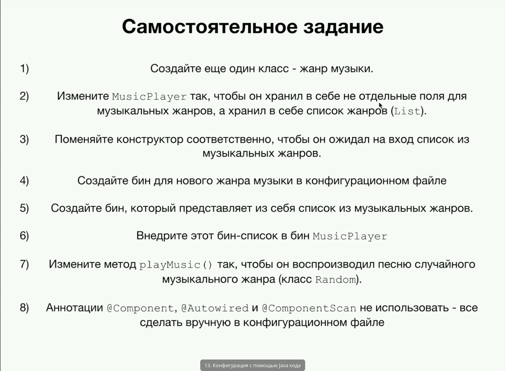
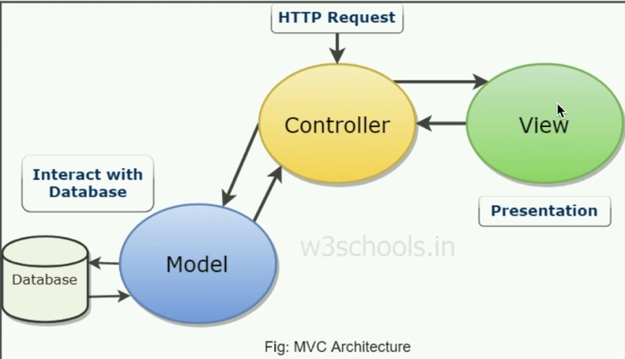
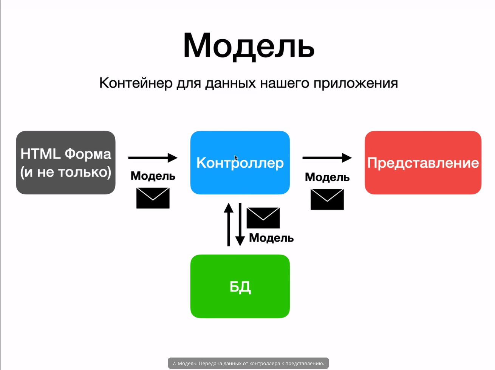
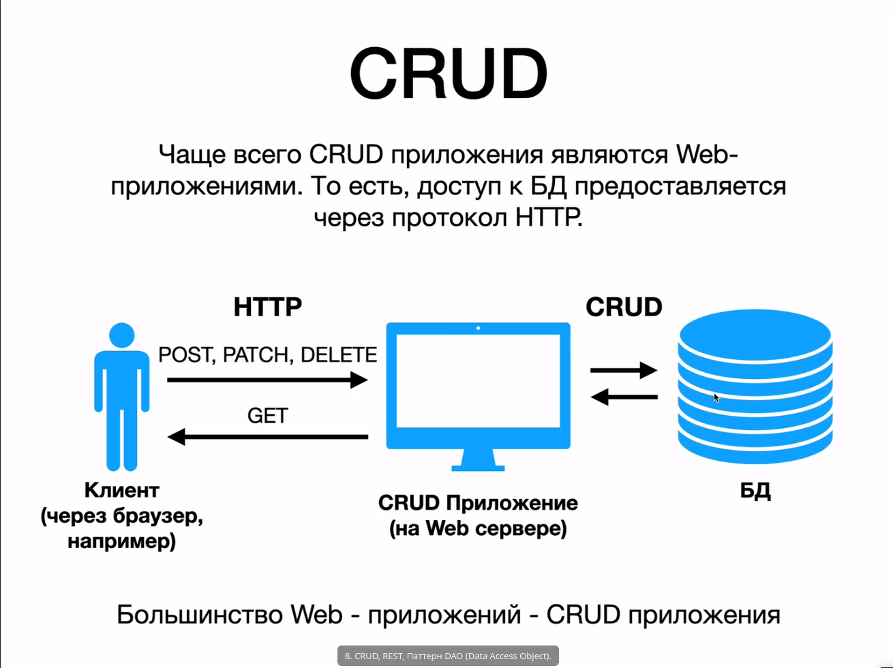
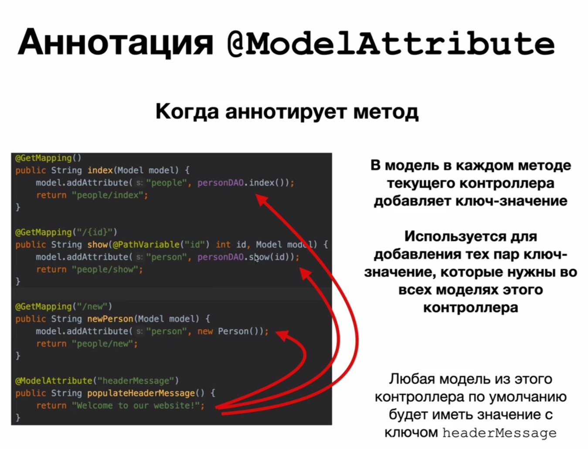
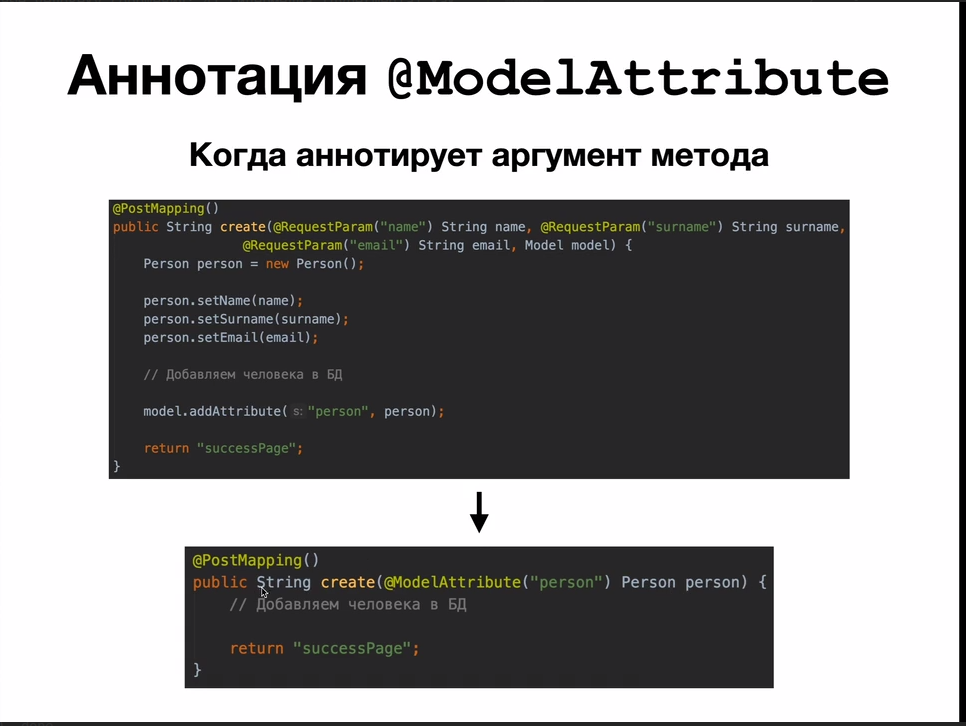
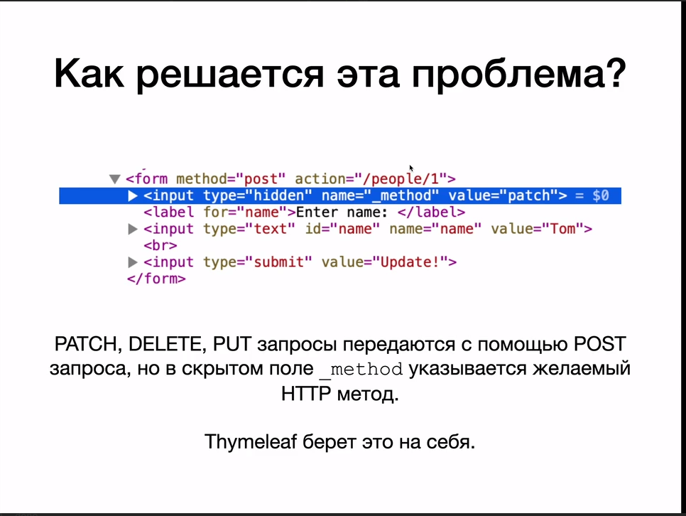

# Spring

1. [Spring Core](#spring-core)
    1. [Инверсия управления. Inversion of Control](#inversion-of-control)
    1. [Внедрение зависимостей. Dependency Injection](#dependency-injection)
    1. [Bean scope (Область видимости бинов)](#bean-scope)
    1. [Жизненный цикл бина (Bean Lifecycle) и его методы](#bean-lifecycle)
    1. [Аннотации](#annotation)
    1. [Конфигурация Spring без xml](#spring-without-xml)
1. [Spring MVC](#spring-mvc)
1. [Полезные ресурсы](#res)

# Spring Core 

Пару слов о Spring. Главными его фишками явлюяются Application context, в
котором создаются и хранятся все Java объекты, что облегчает работу, а также
Dependensy Injection, который управляет зависимостями в нашей программе. А
также Spring является отличной заменой низкоуровневой JDBC.

## Инверсия управления. Inversion of Control 
Bean - обычный java объект, созданный с помощью Spring.

org.springframework.beans и org.springframework.context пакеты являются основой
для контейнера IoC Spring Framework. BeanFactory Интерфейс предоставляет
расширенный механизм настройки, способный управлять объектами любого типа.
ApplicationContext является подинтерфейсом BeanFactory.

Вкратце, BeanFactory предоставляет структуру конфигурации и базовую
функциональность, а ApplicationContext добавляет больше функциональности,
специфичной для предприятия. ApplicationContext Является полным надмножеством
BeanFactory и используется исключительно в этой главе при описании контейнера
IoC Spring. Для получения дополнительной информации об использовании BeanFactory
вместо ApplicationContext,, смотрите раздел, посвященный BeanFactory API.

Инверсия управления решает следующие проблемы:

- Сильная зависимость классов друг от друга.
- Объекты создаются в ручную => приходиться перекомпилировать каждый раз проект.
  А хочется просто иметь файл конфигурации.
- Суть ioc в том, что каждый компонент системы должен быть как можно более
  изолированным от других, не полагаясь в своей работе на детали конкретной
  реализации других компонентов.

На примере с музыкальным проигрывателем, плохое и хорошее составление
зависимостей выглядит так:

Правильное внедрение будет выглядить следующим образом.

Для того, чтобы использовать Beans создается файл ApplicationContext.xml, в котором прописываются все Bean.

Пример:

- id - название bean
- class - путь к классу
- constructor-arg - параметры передающиеся в конструктор.

~~~
<?xml version="1.0" encoding="UTF-8"?>
<beans xmlns="http://www.springframework.org/schema/beans"
       xmlns:xsi="http://www.w3.org/2001/XMLSchema-instance"
       xmlns:context="http://www.springframework.org/schema/context"
       xsi:schemaLocation="http://www.springframework.org/schema/beans
    http://www.springframework.org/schema/beans/spring-beans.xsd
    http://www.springframework.org/schema/context
    http://www.springframework.org/schema/context/spring-context.xsd">

    <bean
        id = "MusicPlayer"
            class = "ru.kuzyakin.springcourse.MusicPlayer">
        <constructor-arg value="Rock"/>
    </bean>
</beans>
~~~

Пример использования:

~~~
package ru.kuzyakin.springcourse;

import org.springframework.context.support.ClassPathXmlApplicationContext;

public class Test {
    public static void main(String[] args){
        ClassPathXmlApplicationContext applicationContext =
                new ClassPathXmlApplicationContext("applicationContext.xml");
        MusicPlayer music = applicationContext.getBean("MusicPlayer",
                MusicPlayer.class);

        System.out.println(music.getMusic());

        applicationContext.close();
    }
}

~~~

## Внедрение зависимостей. Dependency Injection 

Мы смогли решить многие проблемы с помощью ioc, но у нас до сих пор осталась
проблема с тем, что многие объекты мы создаем вручную в главном файле, а также
внедряем в него информацию. А этого хотелось бы избежать.

При использование все объекты/Beans должны браться из контейнера Spring.

Способы внедрения зависимостей (между Beans):

1. через конструктор:
    ~~~
    <bean id = "RockMusic"
          class="ru.kuzyakin.springcourse.RockMusic">
        <constructor-arg value="Marlean Manson"/>
    </bean>
    ~~~
    ~~~
    <bean id = "MusicPlayer"
            class = "ru.kuzyakin.springcourse.MusicPlayer">
        <constructor-arg ref="RockMusic"/>
    </bean>
    ~~~
1. через setor: \
    в name указывается название сетера, при этом с маленькой буквы и без приставки set.
    ~~~
    <bean id = "Setter"
          class="ru.kuzyakin.springcourse.RockMusic">
        <property name="composition" value="Sweet Dreams"/>
    </bean>
    ~~~
1. Из другого файла:
    Для этого в папке resourse создаем файл test.properties, в котором с таким синтаксисом пишем : RockMusic.composition=Some name. 
    
    Тогда в applicationContext нам надо указать следующее:
    ~~~
    <context:property-placeholder
            location="classpath:test.properties"/>

    <bean id = "Setter"
          class="ru.kuzyakin.springcourse.RockMusic">
        <property name="composition" value="${RockMusic.composition}"/>
    </bean>
    ~~~

## Bean scope (область видимости бинов) 

Scope - это способ создания Bean в проекте, также можно сказать патерн создания бина. До этого мы каждый раз создавали Bean как sigleton.

Виды scope:

1. sigleton - объект создается только один раз, все остальные разы возвращается
   ссылка на данный объект (используется по умолчанию).
1. prototype - каждый раз создается новый объект.
1. request - 
1. session - 
1. global-session -

Пример использования prototype:

~~~
<bean id = "RockMusic"
        class="ru.kuzyakin.springcourse.RockMusic"
        scope="prototype">
    <constructor-arg value="Marlean Manson"/>
</bean>
~~~

~~~
RockMusic rockMusic1 = applicationContext.getBean("RockMusic",
        RockMusic.class);
RockMusic rockMusic2 = applicationContext.getBean("RockMusic",
        RockMusic.class);

System.out.println(rockMusic1 == rockMusic2); // false
~~~

## Жизненный цикл бина (Bean Lifecycle) и его методы 

Жизненный цикл бина выгладит следующим образом:

1. Запуск spring приложения.
1. Запуск всех бинов, spring application context.
1. Создается объект бина.
1. В бин внедряются зависимости (dependecy injection).
1. Вызывается init-method. (инициализация ресурсов, обращение к внешним файлам,
   запуск бд)
1. Бин готов к использованию / передается пользователю.
1. По завершению работы, вызывается destroy-method (закрытие потоков, закрытие
   доступа к бд, очищение ресурсов).
1. Остановка Spring приложения.

У методов init и destroy могут быть любые модификаторы доступа, а также они не
могут возвращать или принимать значения на вход.

Для scope = prototype не вызывается destroy метод.

Пример написания init и destroy:

~~~
<bean id = "RockMusic"
        class="ru.kuzyakin.springcourse.RockMusic"
        init-method="Init"
    destroy-method="Destroy">
    <constructor-arg value="Marlean Manson"/>
</bean>

public void Init(){
    System.out.println("Doing init");
}
public void Destroy(){
    System.out.println("Doing destroy");
}
~~~

**Factory-method**

Фабричный метод - это порождающий шаблон проектирования. В момент создания наследники могут определить, какой класс создавать. Иными словами, данный шаблон делегирует создание объектов наследникам родительского класса. Это позволяет использовать в коде программы не конкретные классы, а манипулировать абстрактными объектами на более высоком уровне.

Пример использования:

~~~
<bean id = "RockMusic"
    class="ru.kuzyakin.springcourse.RockMusic"
    scope="prototype" // иначе независимо от того, что в factory-method бин 
                     //создастся один раз
    factory-method="MyFactory">    
</bean>
~~~

## Аннотации 

1. Component - данной анотацией мы помечаем класс, если хотим чтобы из него был
   создан бин.
   ~~~
    <context:component-scan base-package="ru.kuzyakin.springcourse"/>
   ~~~
   Данной строчкой мы указываем дерикторию для сканирования классов, и
   превращения их в бины.
1. Autowired - сканирует все созданиые бины и проверяет, могут или они подойти в
   качестве зависимости в наш создаваемый бин. (если нет ни одного подходящего
   бина или их несколько возникает ошибка). Можно использовать на полях,
   setters, конструкторах (желательно во всем проекте придерживаться одного
   стиля внедрения зависимостей).
1. Qualifier("RockMusick") - указывается предпочтительный id бина, который  
   хотелось бы внедрить. Указывается аналогично Autowired, только при работе с
   конструктором, чуть другой синтаксис:
   ~~~
   @Autowired
   public Musik(@Qualifier("Rock") Music music1){
        ...
   }
   ~~~
1. Scope - указывает, как именно будет создаваться бин.
1. Value("") - в ковычках указывается или значение или название переменной в
   файле ресурсов.
1. PostConstruct - данная аннотация помечает init method.
1. PreDestroy - данная аннотация помечает destroy method.

## Конфигурация Spring без xml 

Чтобы использовать конфигурацию через java класс используется аннотация
@Configuration. Пустой класс аналогичен пустому xml файлу. Для каждого xml тега
есть соответсвующая аннотация:

- component-scan = ComponentScan("путь")
- Bean - создает бин:
  ~~~
    @Configuration
    public class SpringConfig {
        @Bean
        public RockMusic Rock(){
            return new RockMusic("ARIA");
        }

        @Bean
        public Musik Mus() {
            return new Musik(Rock());
        }
    }

    AnnotationConfigApplicationContext applicationContext =
        new AnnotationConfigApplicationContext(SpringConfig.class);
    RockMusic music = applicationContext.getBean("Rock", RockMusic.class);
  ~~~
- property-placeholder = PropertySourse("путь к внешнему файлу с переменными") 

Домашнее задание:

Решение

~~~
@Configuration
public class SpringConfig {
    @Bean
    @Scope("prototype")
    public MusicGenre Rock() {
        return new MusicGenre("Rock");
    }
    @Bean
    @Scope("prototype")
    public MusicGenre Pop() {
        return new MusicGenre("Pop");
    }
    @Bean
    @Scope("prototype")
    public MusicGenre Jazz() {
        return new MusicGenre("Jazz");
    }

    public List<MusicGenre> Genres(){
        return Arrays.asList(Jazz(), Rock(), Pop(), Pop(), Rock(), Jazz());
    }

    @Bean
    public MusicPlayer musicPlayer() {
        return new MusicPlayer(Genres());
    }
}

public class Test {
    public static void main(String[] args){
        AnnotationConfigApplicationContext applicationContext =
                new AnnotationConfigApplicationContext(SpringConfig.class);

        MusicPlayer musicPlayer =
                applicationContext.getBean("musicPlayer", MusicPlayer.class);

        for(int i = 0; i < 10; i++)
            System.out.println(musicPlayer.playMusic());

        applicationContext.close();
    }
}

~~~

# Spring MVC 

Spring MVC - предполагает разработку web приложений с использованием архитектуры
Model - View - Controller.

MVC - это паттерн проектирования приложений. 

- Controller - отвечает за обработку действий пользователя (любое действие
  пользователя в системе обрабатывается в контроллере). 
- Model - содержит всю бизнес-логику приложения. 
- View - отвечает за воспроизведение данных для пользователя.

Для того, чтобы работать с MVC, нам нужно также создать файлы конфигураций контекста.

Servlet - интерфейс java, который взаимодействует с клиентом по принципу: запрос - ответ.

И у нас есть два варианта:

1. С помощью xml конфигурации:
    В web.xml создается конфигурация, которая будет читаться сервером и он будет
    следовать ей.
    Создаем Servlet, указываем Spring конфигурацию applicationContextMVC.
    ~~~
    <?xml version="1.0" encoding="UTF-8"?>
    <web-app xmlns:xsi="http://www.w3.org/2001/XMLSchema-instance"
            xmlns="http://xmlns.jcp.org/xml/ns/javaee"
            xsi:schemaLocation="http://xmlns.jcp.org/xml/ns/javaee http://xmlns.jcp.org/xml/ns/javaee/web-app_3_1.xsd"
            id="WebApp_ID" version="3.1">

        <display-name>SpringMVC</display-name>

        <absolute-ordering/>

        <servlet>
            <servlet-name>dispatcher</servlet-name>
            <servlet-class>org.springframework.web.servlet.DispatcherServlet</servlet-class>
            <init-param>
                <param-name>contextConfigLocation</param-name>
                <param-value>/WEB-INF/applicationContextMVC.xml</param-value>
            </init-param>
            <load-on-startup>1</load-on-startup>
        </servlet>

        <servlet-mapping>
            <servlet-name>dispatcher</servlet-name>
            <url-pattern>/</url-pattern>
        </servlet-mapping>

    </web-app>
    ~~~

    в папке web-inf создаем файл applicationContextMVC, где мы опишем все наши
    бины. annotation-driven включает необходимые аннотации. Бины
    используются для thymeleaf.

    ~~~
    <?xml version="1.0" encoding="UTF-8"?>
    <beans xmlns="http://www.springframework.org/schema/beans"
        xmlns:xsi="http://www.w3.org/2001/XMLSchema-instance"
        xmlns:context="http://www.springframework.org/schema/context"
        xmlns:mvc="http://www.springframework.org/schema/mvc"
        xsi:schemaLocation="
            http://www.springframework.org/schema/beans
            http://www.springframework.org/schema/beans/spring-beans.xsd
            http://www.springframework.org/schema/context
            http://www.springframework.org/schema/context/spring-context.xsd
            http://www.springframework.org/schema/mvc
            http://www.springframework.org/schema/mvc/spring-mvc.xsd">

        <context:component-scan base-package="ru.kuzyakin.java"/>

        <mvc:annotation-driven/>

        <bean id="templateResolver" class="org.thymeleaf.spring5.templateresolver.SpringResourceTemplateResolver">
            <property name="prefix" value="/WEB-INF/views/"/>
            <property name="suffix" value=".html"/>
        </bean>

        <bean id="templateEngine" class="org.thymeleaf.spring5.SpringTemplateEngine">
            <property name="templateResolver" ref="templateResolver"/>
            <property name="enableSpringELCompiler" value="true"/>
        </bean>

        <bean class="org.thymeleaf.spring5.view.ThymeleafViewResolver">
            <property name="templateEngine" ref="templateEngine"/>
            <property name="order" value="1"/>
            <property name="viewNames" value="*"/>
        </bean>
    </beans>
    ~~~

1. С помощью java файла.\
    web.xml можно заменить унаследовавшись от класса
    WebAlpplicationInitializer, но есть еще более простой, но менее свободный
    способ используя класс AbstractAnnotationConfigDispatcherServletInitializer.
    Для данного класа еще необходимо подключить зависимость servlet api.

    Далее создаем папку config в которой у нас будет храниться
    MySpringMvcDispatcherServletInitializer и SpringConfig:

    ~~~
    package config;

    import org.springframework.web.servlet.support.AbstractAnnotationConfigDispatcherServletInitializer;

    public class MySpringMvcDispatcherServletInitializer extends AbstractAnnotationConfigDispatcherServletInitializer {

        protected Class<?>[] getRootConfigClasses() {
            return null;
        }

        protected Class<?>[] getServletConfigClasses() {
            return new Class[] {SpringConfig.class};
        }

        protected String[] getServletMappings() {
            return new String[] {"/"};
        }
    }
    ~~~

    И SpringConfig:
    ~~~
    package config;
    import org.springframework.beans.factory.annotation.Autowired;
    import org.springframework.context.ApplicationContext;
    import org.springframework.context.annotation.Bean;
    import org.springframework.context.annotation.ComponentScan;
    import org.springframework.context.annotation.Configuration;
    import org.springframework.web.servlet.config.annotation.EnableWebMvc;
    import org.springframework.web.servlet.config.annotation.ViewResolverRegistry;
    import org.springframework.web.servlet.config.annotation.WebMvcConfigurer;
    import org.thymeleaf.spring5.SpringTemplateEngine;
    import org.thymeleaf.spring5.templateresolver.SpringResourceTemplateResolver;
    import org.thymeleaf.spring5.view.ThymeleafViewResolver;

    @Configuration
    @ComponentScan("ru.kuzyakin.java")
    @EnableWebMvc
    public class SpringConfig implements WebMvcConfigurer {
        private final ApplicationContext applicationContext;
        @Autowired
        public SpringConfig(ApplicationContext applicationContext) {
            this.applicationContext = applicationContext;
        }
        @Bean
        public SpringResourceTemplateResolver templateResolver() {
            SpringResourceTemplateResolver templateResolver = new SpringResourceTemplateResolver();
            templateResolver.setApplicationContext(applicationContext);
            templateResolver.setPrefix("/WEB-INF/views/");
            templateResolver.setSuffix(".html");
            return templateResolver;
        }
        @Bean
        public SpringTemplateEngine templateEngine() {
            SpringTemplateEngine templateEngine = new SpringTemplateEngine();
            templateEngine.setTemplateResolver(templateResolver());
            templateEngine.setEnableSpringELCompiler(true);
            return templateEngine;
        }
        @Override
        public void configureViewResolvers(ViewResolverRegistry registry) {
            ThymeleafViewResolver resolver = new ThymeleafViewResolver();
            resolver.setTemplateEngine(templateEngine());
            registry.viewResolver(resolver);
        }
    }
    ~~~

Затем идут общие дествия:

Создание контройлера:

~~~
@Controller
public class HelloController {

    @GetMapping("/hello-world")
    public String sayHello() {
        return "Hello world";
    }
}
~~~

В папке web-inf создаем папку с представлениями views.
В ней будут находится наши шаблоны, которые мы будем показывать пользователю.

Пример представления:

~~~
<!DOCTYPE html>
<html xmlns:th="http://www.thymeleaf.org" lang="en">
<head>
    <meta charset="UTF-8">
    <title>Title</title>
</head>
<body>

Hello world

</body>
</html>
~~~

## Контройлеры

К аннотации controller, также как и component автоматически создается bean. 
Если мы помечаем контройлер аннотацией @RequestMapping("/peple"), то все методы в данном контроллере будут начинаться с "/peple/..."

## Параметры Get запроса

Чтобы обработать параметры, которые передаются в get запросе есть два метода:

1. С помощью HttpServletRequest:
    ~~~
    public String hellow(HttpServletRequest request){
        String name = request.getParameter("name");
    }
    ~~~
2. С помощью @RequestParam:
    ~~~
    public String hellow(@RequestParam("name") String name){
        ...
    }
    ~~~
3. Также чтобы получить информацию прямо из url адреса используется следующая
   аннотация:
   ~~~
   @GetMapping("/{id}")
   public String hellow(@PathVarible("id") int id){
        ...
   }
   ~~~

## Передача данных от контроллера к представлению.

Для передачи данных между объектами в веб приложение используется модель.

Чтобы работать с моделью используется класс Model:

1. addAtribute("key", "value") - добавить атрибут в модель.
1. getAtribute("key") - получает значение по ключу.

Чтобы получить значения из модели в предстваление нужно написать:

~~~
public String hellow(@RequestParam("name") String name,
                    Model model){
    ...
}
~~~

~~~

th:text="{key}"

~~~

## Grud, Rest, DAO(Data Acces Object)

CRUD 4 базовые функции при работе с базами данных, и все взаимодействия с
сетрвером сводятся к этим 4 операциям:

1. Create / Post
1. Read / Get
1. Update / Patch
1. Delete / Delete

Rest - это патерн проектирования веб приложений.
Руководящие принипы написания RESTful-интерфейсов:

1. **Client-Server**. Отделяя пользовательский интерфейс от хранилища данных, мы
   улучшаем переносимость пользовательского интерфейса на другие платформы и
   улучшаем масштабируемость серверных компонент засчёт их упрощения.
1. **Stateless (без состояния)**. Каждый запрос от клиента к серверу должен
   содержать в себе всю необходимую информацию и не может полагаться на какое-либо состояние, хранящееся на стороне сервера. Таким образом, информация о текущей сессии должна целиком храниться у клиента. 
1. **Cacheable (кэшируемость)**. Это ограничение требует, чтобы для данных в
   ответе на запрос явно было указано -- можно их кэшировать или нет. Если
   ответ поддерживает кэширование, то клиент имеет право повторно использовать
   данные в последующих эквивалентных запросов без обращения на сервер.
1. **Uniform interface (единообразие интерфейса)**. Если применить к систем
   инженерный принцип общности/единообразия, то архитектура всего приложения
   станет проще, а взаимодействие станет прозрачнее и понятнее. Для выполнения
   этого принципа необходимо придерживаться нескольких архитектурных
   ограничений. REST накладывает на интерфейс четыре ограничения: 1)
   идентичность ресурсов; 2) манипуляция над ресурсами через представление; 3)
   исчерпывающие, понятные человеку сообщения; 4) гипермедиа (hypermedia) как
   движок для состояния приложения (HATEOAS) -- ссылки на другие ресурсы внутри
   приложения.
1. **Layered system (многоуровневая система)**. Многоуровневость достигается
   засчёт ограничения поведения компонентов таким образом, что компоненты "не
   видят" другие компоненты, кроме расположенных на ближайших уровнях, с
   которыми они взаимодействуют.

1. **Code on demand (код по мере необходимости, необятельно)**. REST позволяет
   наращивать функциональность клиентского приложения по мере необходимости при
   помощи скачивания и исполнения кода в виде апплетов или скриптов. Это
   упрощает клиентские приложения, уменьшая количество заранее написанных
   возможностей.

Dao - Data Acces Object паттерн проектирования, при котором взаимодействие с бд
выносится в отдельный класс.

## Model Attribute

У аннотации ModelAttribute есть 2 варианта использования:

1. когда она аннотирует метод, она добавляет соответсвующее значение key value,
   в каждую модель контролера: 
   
1. когда она аннотирует аргумент метода, то она считывает параметры поступившего
   запроса и записывает их в поля класса, а затем кладет этот объект класса в
   модель: 

## Put, Patch, Delete

Дело в том, что html5 поддерживает в поле method только значение get и post.
Можно реализовывать остальные запросы через post, но это плохой тон, ведь протокол http дает нам разнообразие методав.

Для того чтобы работать с таким полем используются фильтры. Фильтр изменяет метод входящего http запроса, если имеется скрытое поле.

Чтобы добавить фильтр нужно написать в MySpringMvcDispatcherSerlvetIntitializer
следующие 2 метода:

~~~
@Override
public void onStartup(ServletContext aServletContext) throws ServletException {
    super.onStartup(aServletContext);
    registerHiddenFieldFilter(aServletContext);
}

private void registerHiddenFieldFilter(ServletContext aContext) {
    aContext.addFilter("hiddenHttpMethodFilter",
            new HiddenHttpMethodFilter()).addMappingForUrlPatterns(null ,true, "/*");
}
~~~

## Валидация форм

Для валидации необходимо подключить зависимость hibernate validator.

Внутри нашего класса, над котором мы хотим применить валидацию, мы можем указать над полями следующие аннотации:

- NotEmpty(messege="...")
- Size(min = 2, max = 30)

В самом контройлере в момент, когда может произойти ошибка нужно указать
аннотацию @valid и принимать объект BindingResult.

~~~
@PostMapping()
public String hellow(@ModelAttribute("person") @Valid Person person, 
                     BindingResult bindingResult){
    if (bindingResult.hasErrors())
        return;
    ...
}
~~~

## Связь приложения и базы данных

Существует 3 варианта абстракции при работе с базой данных из java.

1. JDBC - самый низкий уровень, все запросы пишутся в ручную.

1. JdbcTemplate - обертка вокруг JDBC, часть Spring Framework.

1. Hibernate - самый высокий уровень абстракции. Может создавать таблицы в бд на
   основе наших java классов, это называется ORM ("object relation mapping").

### JDBC

Чтобы подключиться через jdbc нужно скачать необходимый драйвер на компьютер и
произвести подключение к базе данных. 

На примере postgres sql:

~~~
    private static final String URL = "jdbc:postgresql://localhost:5432/first_db";
    private static final String USERNAME = "postgres";
    private static final String PASSWORD = "postgres";

    static {
        try {
            Class.forName("org.postgresql.Driver");
        } catch (ClassNotFoundException e) {
            e.printStackTrace();
        }

        try {
            connection = DriverManager.getConnection(URL, USERNAME, PASSWORD);
        } catch (SQLException throwables) {
            throwables.printStackTrace();
        }
    }
~~~

Так мы создали подключение.
Затем нам нужно создать объект запроса и с помощью команды execute or executeQuery выполнить его.
~~~
Statement statement = connection.createStatement();
String SQL = "SELECT * FROM Person";
ResultSet resultSet = statement.executeQuery(SQL);
~~~

### SQL инъекции

Для того, чтобы избежать SQL инъекций используется класс PreparedStatement.

Его преимущества:
- Запросы пишутся полностью, не нужно использовать конкатенацию строк. 
- Удобнее, чем Statment.
- Быстрее, чем Statment
- Предотвращает SQL инъекции.

Пример использования:

~~~
try {
    PreparedStatement preparedStatement = connection.prepareStatement("INSERT INTO Person VALUES(1, ?, ?, ?)");
    

    preparedStatement.setString(1, person.getName()); 
    preparedStatement.setInt(2, person.getAge()); 
    preparedStatement.setString(3, person.getEmail());
    statement.executeUpdate(SQL);
} 
catch (SQLException throwables) { 
    throwables.printStackTrace();
} 
~~~

### JdbcTemlate

Проблема jdbc в том, что слишком много лишнего кода и дублирование кода, как создание connaction, statment, Result. Также неинформативный SqlExeption.

Для работы с JDBC template нужно добавить два новых beand.
~~~
    @Bean
    public DataSource dataSource() {
        DriverManagerDataSource dataSource = new DriverManagerDataSource();

        dataSource.setDriverClassName("org.postgresql.Driver");
        dataSource.setUrl("jdbc:postgresql://localhost:5432/first_db");
        dataSource.setUsername("postgres");
        dataSource.setPassword("postgres");

        return dataSource;
    }

    @Bean
    public JdbcTemplate jdbcTemplate() {
        return new JdbcTemplate(dataSource());
    }

~~~

Затем мы внедряем наш Jdbc template в DAO:

~~~
@Autowired
public PersonDAO(JdbcTemplate jdbcTemplate) {
    this.jdbcTemplate = jdbcTemplate;
}
~~~

Затем, чтобы сделать запрос используем функцию query - первый аргумет это запрост. а второй RowMapper - это объект, который будет результат запроса записывать в нужный нам объект:

~~~
 public List<Person> index() {
        return jdbcTemplate.query("SELECT * FROM Person", new PersonMapper<>(Person.class));
    }
~~~

Для этого нужно создать данный RowMapper:

~~~
public class PersonMapper implement RowMapper<Person>{
    @0verride
    public Person mapRow(ResultSet resultSet, int i) throws SQLException { 
        Person person = new Person();
        
        person.setId(resultSet.getInt("id")); 
        person.setName(resultSet.getString("name")); 
        person.setEmail(resultSet.getString("email")); 
        person.setAge(resultSet.getInt("age"));
        
        return person;
    }
}
~~~

Пример поиска человека по id:

~~~
    public Person show(int id) {
        return jdbcTemplate.query("SELECT * FROM Person WHERE id=?", 
            new Object[]{id}, new BeanPropertyRowMapper<>(Person.class))
                .stream().findAny().orElse(null);
    }
~~~

И сохранение нового ползователя:

~~~
    public void save(Person person) {
        jdbcTemplate.update("INSERT INTO Person VALUES(1, ?, ?, ?)", person.getName(), person.getAge(),
                person.getEmail());
    }
~~~

Аналогично update пользователя:
~~~
public void update(int id, Person updatedPerson) {
    jdbcTemplate.update("UPDATE Person SET name=?, age=?, email=? WHERE id=?", 
    updatedPerson.getName(), updatedPerson.getAge(), updatedPerson.getEmail(), id);
}
~~~

## Конфигурация бд из внешнего файла

Обычно такие файлы лежат в папке resourse, расширение у данного файла properties, также создается файл с расширением properties.origin, в котором указыватеся какие именно данные нужны для работы базы данных:

С помощью аннотации @PropertySourse("classpath:databese.properties") указываем путь до нашего файла.
~~~
driver=org.postgresql.Driver
url=jdbc:postgresql://localhost:5432/first_db
username=postgres
password=postgres
~~~

~~~
driver=
url=
username=
password=
~~~

Чтобы обратиться к данным полям мы создаем объект Enviromment, он часть spring-framework.

~~~
  private final Enviromment enviroment = ;
  @Bean
    public DataSource dataSource() {
        DriverManagerDataSource dataSource = new DriverManagerDataSource();

        dataSource.setDriverClassName(enviromment.getProperty("driver"));
        dataSource.setUrl(enviromment.getProperty("url"));
        dataSource.setUsername(enviromment.getProperty("username"));
        dataSource.setPassword(enviromment.getProperty("password")));

        return dataSource;
    }
~~~

## Butch update (пакетное обновление)

Допустим у нас нужно поместить 1000 пользователей в базу данных. Если мы будем делать запросы по 1 пользователю, то это займет много времени.

В JdbcTemplate есть специальный метод для пакетной вставки batchUpdate():

~~~
jdbcTemplate.batchUpdate("INSERT INTO Person values(?,?,?,?)", 
    new BatchPreparedStatmentSetter(){
        @Override
        public void setValues(PreparedStatment preparedStatment, int i) {
            preparedStatment.setInt(1, people.get(i).getId());
            preparedStatment.setString(2, people.get(i).getName());
            preparedStatment.setInt(3, people.get(i).getEge());
            preparedStatment.setString(4, people.get(i).getEmail());
        }

        @Override
        public int getBatchSize(){
            return people.size(); // peple - лист
        }
    });
~~~

## Чуть-чуть о базах данных (в частности postgres)

В postgres нет autoincrement, для этого используется макрос SERIAL. Его можно даже создать вручную (для этого используется sequence - последовательность):

~~~
create sequence test_sequence

select nextval('test_sequence')
~~~

~~~
CREATE TABLE foo (
    id SERIAL,
    bar varchar
);

// новая версия после postgres 10

CREATE TABLE foo (
    id int GENERATE BY DEFAULD AS IDENTITY,
    bar varchar
);

~~~

# Полезные ресурсы 

1. [Документация Spring
   Framework](https://docs.spring.io/spring-framework/reference/overview.html)
