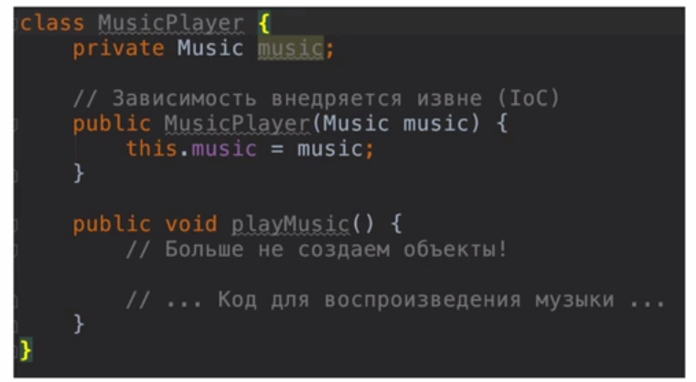

# Spring

1. [Spring Core](#spring-core)
    1. [Инверсия управления. Inversion of Control](#inversion-of-control)
    1. [Внедрение зависимостей. Dependency Injection](#dependency-injection)
    1. [Bean scope (Область видимости бинов)](#bean-scope)
    1. [Жизненный цикл бина (Bean Lifecycle) и его методы](#bean-lifecycle)
    1. [Аннотации](#annotation)
    1. [Конфигурация Spring без xml](#spring-without-xml)
1. [Spring MVC]()
1. [Полезные ресурсы](#res)

# Spring Core 

Пару слов о Spring. Главными его фишками явлюяются Application context, в
котором создаются и хранятся все Java объекты, что облегчает работу, а также
Dependensy Injection, который управляет зависимостями в нашей программе. А
также Spring является отличной заменой низкоуровневой JDBC.

## Инверсия управления. Inversion of Control 
Bean - обычный java объект, созданный с помощью Spring.

org.springframework.beans и org.springframework.context пакеты являются основой
для контейнера IoC Spring Framework. BeanFactory Интерфейс предоставляет
расширенный механизм настройки, способный управлять объектами любого типа.
ApplicationContext является подинтерфейсом BeanFactory.

Вкратце, BeanFactory предоставляет структуру конфигурации и базовую
функциональность, а ApplicationContext добавляет больше функциональности,
специфичной для предприятия. ApplicationContext Является полным надмножеством
BeanFactory и используется исключительно в этой главе при описании контейнера
IoC Spring. Для получения дополнительной информации об использовании BeanFactory
вместо ApplicationContext,, смотрите раздел, посвященный BeanFactory API.

Инверсия управления решает следующие проблемы:

- Сильная зависимость классов друг от друга.
- Объекты создаются в ручную => приходиться перекомпилировать каждый раз проект.
  А хочется просто иметь файл конфигурации.
- Суть ioc в том, что каждый компонент системы должен быть как можно более
  изолированным от других, не полагаясь в своей работе на детали конкретной
  реализации других компонентов.

На примере с музыкальным проигрывателем, плохое и хорошее составление
зависимостей выглядит так:

Правильное внедрение будет выглядить следующим образом.

Для того, чтобы использовать Beans создается файл ApplicationContext.xml, в котором прописываются все Bean.

Пример:

- id - название bean
- class - путь к классу
- constructor-arg - параметры передающиеся в конструктор.

~~~
<?xml version="1.0" encoding="UTF-8"?>
<beans xmlns="http://www.springframework.org/schema/beans"
       xmlns:xsi="http://www.w3.org/2001/XMLSchema-instance"
       xmlns:context="http://www.springframework.org/schema/context"
       xsi:schemaLocation="http://www.springframework.org/schema/beans
    http://www.springframework.org/schema/beans/spring-beans.xsd
    http://www.springframework.org/schema/context
    http://www.springframework.org/schema/context/spring-context.xsd">

    <bean
        id = "MusicPlayer"
            class = "ru.kuzyakin.springcourse.MusicPlayer">
        <constructor-arg value="Rock"/>
    </bean>
</beans>
~~~

Пример использования:

~~~
package ru.kuzyakin.springcourse;

import org.springframework.context.support.ClassPathXmlApplicationContext;

public class Test {
    public static void main(String[] args){
        ClassPathXmlApplicationContext applicationContext =
                new ClassPathXmlApplicationContext("applicationContext.xml");
        MusicPlayer music = applicationContext.getBean("MusicPlayer",
                MusicPlayer.class);

        System.out.println(music.getMusic());

        applicationContext.close();
    }
}

~~~

## Внедрение зависимостей. Dependency Injection 

Мы смогли решить многие проблемы с помощью ioc, но у нас до сих пор осталась
проблема с тем, что многие объекты мы создаем вручную в главном файле, а также
внедряем в него информацию. А этого хотелось бы избежать.

При использование все объекты/Beans должны браться из контейнера Spring.

Способы внедрения зависимостей (между Beans):

1. через конструктор:
    ~~~
    <bean id = "RockMusic"
          class="ru.kuzyakin.springcourse.RockMusic">
        <constructor-arg value="Marlean Manson"/>
    </bean>
    ~~~
    ~~~
    <bean id = "MusicPlayer"
            class = "ru.kuzyakin.springcourse.MusicPlayer">
        <constructor-arg ref="RockMusic"/>
    </bean>
    ~~~
1. через setor: \
    в name указывается название сетера, при этом с маленькой буквы и без приставки set.
    ~~~
    <bean id = "Setter"
          class="ru.kuzyakin.springcourse.RockMusic">
        <property name="composition" value="Sweet Dreams"/>
    </bean>
    ~~~
1. Из другого файла:
    Для этого в папке resourse создаем файл test.properties, в котором с таким синтаксисом пишем : RockMusic.composition=Some name. 
    
    Тогда в applicationContext нам надо указать следующее:
    ~~~
    <context:property-placeholder
            location="classpath:test.properties"/>

    <bean id = "Setter"
          class="ru.kuzyakin.springcourse.RockMusic">
        <property name="composition" value="${RockMusic.composition}"/>
    </bean>
    ~~~

## Bean scope (область видимости бинов) 

Scope - это способ создания Bean в проекте, также можно сказать патерн создания бина. До этого мы каждый раз создавали Bean как sigleton.

Виды scope:

1. sigleton - объект создается только один раз, все остальные разы возвращается
   ссылка на данный объект (используется по умолчанию).
1. prototype - каждый раз создается новый объект.
1. request - 
1. session - 
1. global-session -

Пример использования prototype:

~~~
<bean id = "RockMusic"
        class="ru.kuzyakin.springcourse.RockMusic"
        scope="prototype">
    <constructor-arg value="Marlean Manson"/>
</bean>
~~~

~~~
RockMusic rockMusic1 = applicationContext.getBean("RockMusic",
        RockMusic.class);
RockMusic rockMusic2 = applicationContext.getBean("RockMusic",
        RockMusic.class);

System.out.println(rockMusic1 == rockMusic2); // false
~~~

## Жизненный цикл бина (Bean Lifecycle) и его методы 

Жизненный цикл бина выгладит следующим образом:

1. Запуск spring приложения.
1. Запуск всех бинов, spring application context.
1. Создается объект бина.
1. В бин внедряются зависимости (dependecy injection).
1. Вызывается init-method. (инициализация ресурсов, обращение к внешним файлам,
   запуск бд)
1. Бин готов к использованию / передается пользователю.
1. По завершению работы, вызывается destroy-method (закрытие потоков, закрытие
   доступа к бд, очищение ресурсов).
1. Остановка Spring приложения.

У методов init и destroy могут быть любые модификаторы доступа, а также они не
могут возвращать или принимать значения на вход.

Для scope = prototype не вызывается destroy метод.

Пример написания init и destroy:

~~~
<bean id = "RockMusic"
        class="ru.kuzyakin.springcourse.RockMusic"
        init-method="Init"
    destroy-method="Destroy">
    <constructor-arg value="Marlean Manson"/>
</bean>

public void Init(){
    System.out.println("Doing init");
}
public void Destroy(){
    System.out.println("Doing destroy");
}
~~~

**Factory-method**

Фабричный метод - это порождающий шаблон проектирования. В момент создания наследники могут определить, какой класс создавать. Иными словами, данный шаблон делегирует создание объектов наследникам родительского класса. Это позволяет использовать в коде программы не конкретные классы, а манипулировать абстрактными объектами на более высоком уровне.

Пример использования:

~~~
<bean id = "RockMusic"
    class="ru.kuzyakin.springcourse.RockMusic"
    scope="prototype" // иначе независимо от того, что в factory-method бин 
                     //создастся один раз
    factory-method="MyFactory">    
</bean>
~~~

## Аннотации 

1. Component - данной анотацией мы помечаем класс, если хотим чтобы из него был
   создан бин.
   ~~~
    <context:component-scan base-package="ru.kuzyakin.springcourse"/>
   ~~~
   Данной строчкой мы указываем дерикторию для сканирования классов, и
   превращения их в бины.
1. Autowired - сканирует все созданиые бины и проверяет, могут или они подойти в
   качестве зависимости в наш создаваемый бин. (если нет ни одного подходящего
   бина или их несколько возникает ошибка). Можно использовать на полях,
   setters, конструкторах (желательно во всем проекте придерживаться одного
   стиля внедрения зависимостей).
1. Qualifier("RockMusick") - указывается предпочтительный id бина, который  
   хотелось бы внедрить. Указывается аналогично Autowired, только при работе с
   конструктором, чуть другой синтаксис:
   ~~~
   @Autowired
   public Musik(@Qualifier("Rock") Music music1){
        ...
   }
   ~~~
1. Scope - указывает, как именно будет создаваться бин.
1. Value("") - в ковычках указывается или значение или название переменной в
   файле ресурсов.
1. PostConstruct - данная аннотация помечает init method.
1. PreDestroy - данная аннотация помечает destroy method.

## Конфигурация Spring без xml 

Чтобы использовать конфигурацию через java класс используется аннотация
@Configuration. Пустой класс аналогичен пустому xml файлу. Для каждого xml тега
есть соответсвующая аннотация:

- component-scan = ComponentScan("путь")
- Bean - создает бин:
  ~~~
    @Configuration
    public class SpringConfig {
        @Bean
        public RockMusic Rock(){
            return new RockMusic("ARIA");
        }

        @Bean
        public Musik Mus() {
            return new Musik(Rock());
        }
    }

    AnnotationConfigApplicationContext applicationContext =
        new AnnotationConfigApplicationContext(SpringConfig.class);
    RockMusic music = applicationContext.getBean("Rock", RockMusic.class);
  ~~~
- property-placeholder = PropertySourse("путь к внешнему файлу с переменными") 

# Полезные ресурсы 

1. [Документация Spring
   Framework](https://docs.spring.io/spring-framework/reference/overview.html)
