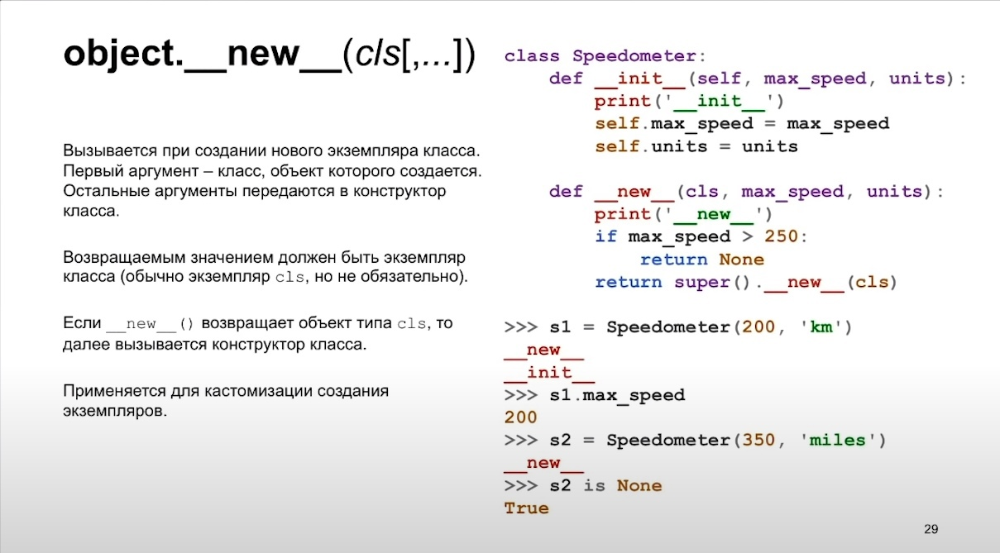
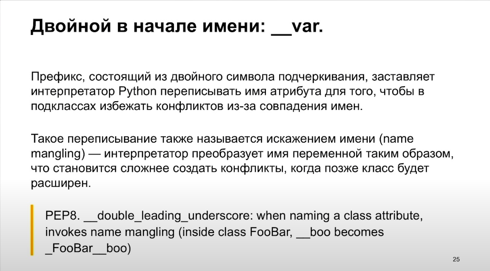
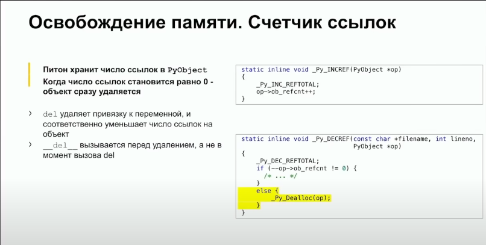
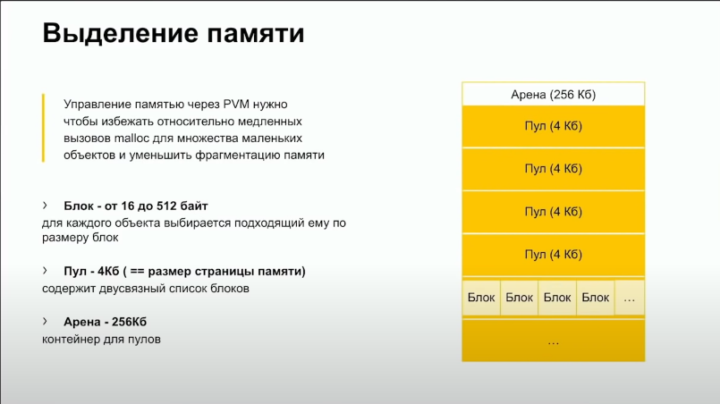
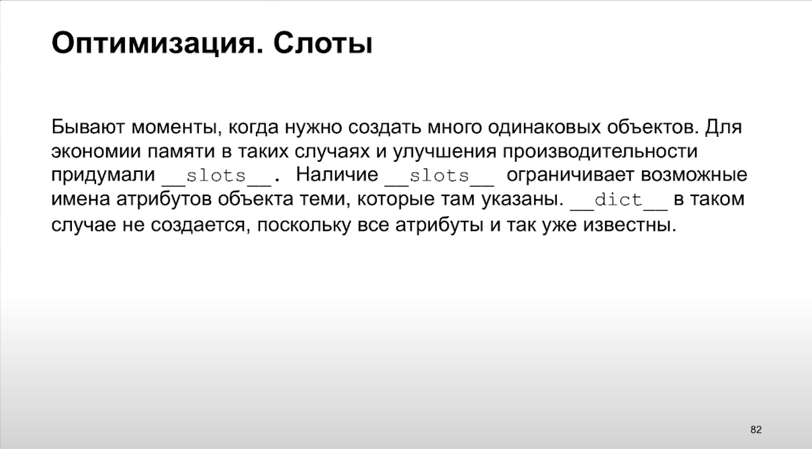
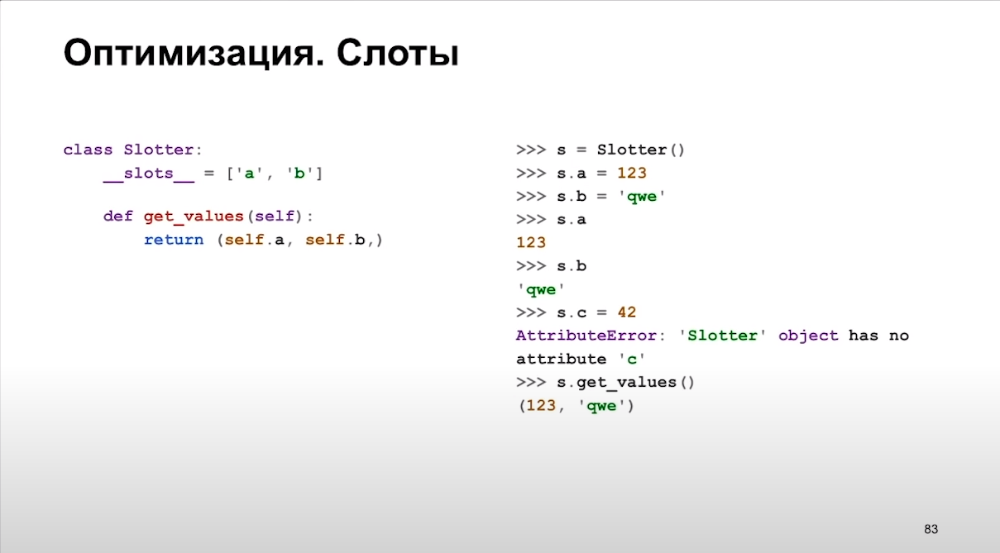

# Учебник по Python

## Оглавление
1. [Введение в python](#introduction-to-python)
    1. [Типы данных в python](#data-types-in-python)
    2. [Арифметические операции в python](#arithmetic-operations)
    3. [Основные алгоритмические конструкции](#basic-algorithmic-constructions)
    4. [Параметры функции print()](#print()-function-parameters)
    5. [Функции](#functions)
    6. [Работа с файлами](#working-with-files)
    7. [Обработка исключений](#exception-handling)
    8. [Области видимости](#scope)
    9. [Модули](#modules)
    10. [Самое необходимое об ООП](#oop)
    11. [Декораторы](#decorators)
    12. [Факты о python](#facts-about-python)
1. [Что такое backend]()
2. [Postger SQL]()
3. [Самое необходимое об ООП]()
4. [Energy Management]()
5. [Проект 1: калькулятор денег и калорий]()
6. [Django]()
7. [Дополнительные компоненты Django]()
8. [Тестирование]()
9. [Инфраструктура бэкенд-разработки]()
10. [Docker: приложение в коробке]()
11. [Оптимизация и мониторинг docker-образов. DockerHub]()
12. [Полезные ресурсы](#res)

## Введение в python  

Python — интерпретируемый язык программирования с сильной динамической типизацией. 

Сильная — значит, что язык не допускает неявных приведений типов в неоднозначных ситуациях или когда будет утрачена точность, например, нельзя “сложить” число и строку.

Динамическая — значит, что тип переменной определяется во время присваивания ей значения и может изменяться по ходу программы.

### Типы данных в python 

None: пустое значение.

Числа: 
1. int
2. float
3. complex

**Строки и операции над ними: string**

Срез:

    Общий вид среза s[x : y : h], где: 
    * x - номер элемента, с которого начинается срез,
    * y - номер первого элемента, невошедшего в срез,
    * h - шаг среза.    

len(s) - длина строки.

s.split() - разделяет строку по символу разделителя

Проверки внутри строк:
* s.isalpha() - состоит ли строка из букв;
* s.isalnum() - состоит ли строка из цифр и букв;
* s.islower() - состоит ли строка из букв в нижнем регистре;
* s.isupper() - состоит ли строка из букв в верхнем регистре;
* s.isspace() - состоит ли строка из пробельных символов;
* s.istitle() - начинаются ли слова в строке с заглавной буквы.

* s.startswith(...) - начинается ли строка s с указанного шалона;
* s.endswith(...) - заканчивается ли строка шаблоном.

**f строки**

Начиная с версии 3.6 в Python появился новый тип строк - f-строки. Эти строки предназначены для подстановки значений выражений непосредственно в строку. Подстановки обозначаются фигурными скобками {}, внутри которых записывается переменная или выражение, результат вычисления которого должен быть встроен в строку, а также дополнительная информация об отображении, например, число знаков после десятичной точки. f-строки улучшают читаемость кода, а также работают быстрее чем другие способы форматирования. Они задаются с помощью литерала «f» перед кавычками.

~~~
name = 'Bob'
print(f'Hello, {name}!')
~~~

**Кортежи: tuple**

По аналогии со списками кортежи в Python — это стандартный тип, позволяющий хранить значения в виде последовательности. Они полезны в тех случаях, когда необходимо передать данные, не позволяя изменять их. Эти данные могут быть использованы, но в оригинальной структуре изменения не отобразятся. Также картежи весят меньше чем списки.

Также все элементы уникальны.

Кортежи создают с помощью круглых скобок (). Для создания нужно написать следующее:

~~~
cake = ('c','a','k','e') 
print(type(cake))

a = (5) не кортеж
a = (5, ) кортеж
~~~

**Списки: list**

Список - упорядоченная изменяемая коллекция объектов произвольных типов (list).

~~~
a = [1, '2', 3.4]

b = list() создание пустого списка или 
b = []
~~~

* append(x) - функция используется, чтобы добавить элемент в список.

* insert(index, x) - вставляет в нужную позицию требуемое значение.

* pop() - удаляет последний элемент(можно передать индекс и будет аналогично remove).

* remove(index) - удаляет элемент по индексу.

К элементам можно обращаться и заменять по индексу.

К спискам можно применять срезы:

~~~
a = [1, 3, 8, 7]
a[START:STOP:STEP]
~~~

**Словари: dict**

Словарь dict - это ноль или более пар вида key: value, где key - это объект типа данных, таких как float, frozenset, int, str и tuple. value может быть объектом любог типа. Объявляется словарь фигурными скобками.

~~~
Добавление пары ключ-значение в словарь

d = {}
d['name'] = 'Anna'
d['age'] = 26
print(d)

out: {'name': 'Anna', 'age': 26}

Проверка наличия ключа в словаре

'name' in d

Общий вид этого метода get: 

dict.get(key[, default]) 

где key - это искомый ключ, а default - это значение, которое возвращает метод, если данный ключ не найден.
~~~

Методы для работы со словарем:
* len(dict) - количество пар "ключ-значение" в словаре
* del key - удаляет клюя вместе со значением из словаря
* dict.key() - возвращает список ключей словаря
* dict.values() - возвращает список значений словаря
* dict.items() - возвращает список кортежей (key, value)
* dict.clear() - очищает словарь

**Множества: set и frozenset**

Тип set – это неупорядоченная коллекция из нуля или более ссылок на объекты.

Все встроенные неизменяемые типы данных, такие как float, frozenset, int, str и tuple, являются хешируемыми объектами и могут добавляться во множества. Встроенные изменяемые типы данных, такие как dict, list и set, не являются хешируемыми объектами, так как значение хеша в каждом конкретном случае зависит от содержащихся в объекте элементов, поэтому они не могут добавляться в множества.

Множества объявляются через фигурные скобки, как и словари. Отличие заключается в том, что элемент станет множеством, если не будет ни одной пары ключ значение.

~~~
a = {a, b, c, d}
~~~

Методы множеств:
1. Добавление и удаление:
    * s.add(x) - добавляет элементы x во множество s, если они отсутствуют в s;
    * s.update(t) - добавляет во множество s все элементы множества t, отсутствующие в множестве s, аналогично s |= t (update есть и у словарей, о которых мы поговорим чуть позже).
    * s.discard(x) - удаляет элемент x из множества s, если он * присутствует в множестве s;
    * s.pop() - возвращает и удаляет случайный элемент множества s или возбуждает исключение KeyError, если s – это пустое множество;
    * s.remove(x) - удаляет элемент x из множества s или возбуждает исключение KeyError, если элемент x отсутствует в множестве s, аналогично set.discard();
    * s.clear() - удаляет все элементы из множества s;
    * s.copy() - возвращает поверхностную копию множества s.
2. Специфичные для множеств методы:
    * s.difference(t) - возвращает новое множество, включающее элементы множества s, которые отсутствуют в множестве t, аналогично s - t;
    * s.difference_update(t) - удаляет из множества s все элементы, присутствующие в множестве t, аналогично s -= t;
    * s.intersection(t) - возвращает новое множество, включающее элементы, присутствующие одновременно в множествах s и t, аналогично s & t;
    * s.intersection_update(t) - оставляет во множестве s пересечение множеств s и t, аналогично s &= t;
    * s.isdisjoint(t) - возвращает True, если множества s и t не имеют общих элементов;
    * s.issubset(t) или s <= t - возвращает True, если множество s эквивалентно множеству t или является его подмножеством; чтобы проверить, является ли множество s только подмножеством множества t, следует использовать проверку s < t;
    * s.issuperset(t) или s >= t - возвращает True, если множество s эквивалентно множеству t или является его над множеством; чтобы проверить, является ли множество s только над множеством множества t, следует использовать проверку s > t;
    * s.symmetric_difference(t) - возвращает новое множество, включающее все элементы, присутствующие в множествах s и t, за исключением элементов, присутствующих в обоих множествах одновременно, аналогично s ^ t;
    * s.symmetric_difference_update(t) - возвращает в множестве s результат строгой дизъюнкции множеств s и t, аналогично s ^= t;
    * s.union(t) - возвращает новое множество, включающее все элементы множества s и все элементы множества t, отсутствующие в множестве s, аналогично s | t;

Единственное отличие set от frozenset заключается в том, что set - изменяемый тип данных, а frozenset - нет.

### Арифметические операции в python 

* \+ — сложение
* \- — вычитание
* \* — умножение (строку можно умножить на число)
* / — деление
* // — целочисленное деление (возвращает только целую часть от деления,  значение после запятой отбрасывается)
* % — деление по модулю (возвращает остаток от деления)
* ** — возведение в степень

**Битовые операторы**

* & – побитовое и
* | – побитовое или 
* ^ – xor
* << >> – операторы сдвига влево или сдвига вправо на заданное количество бит
* ~ – битовый оператор НЕТ 

### Основные алгоритмические конструкции 

**Ветвление**

~~~
if <условие 1>:
    <операторы, если условие 1 истинно>
elif <условие 2>:
    <операторы, если условие 2 истинно>
elif <условие 3>:
    ...
else:
    <операторы, если все условия ложны>
~~~

**Тернарный оператор**

~~~
[если истина] if [выражение] else [если ложь]
~~~

Пример:

~~~
x, y = 25, 50
big = x if x < y else y
~~~

**Итерационный цикл**

~~~
while <условие>:
    <тело цикла, в котором есть break>
else:
    <операторы, если цикл завершился без break>
~~~

**Арифметический цикл**
~~~
for <проход по итератору>:
    <тело цикла>
~~~

Пример:

~~~
for i in range (1, 6, 1):
    print(i)

for i in 'aasdasd':
    print(i)
~~~

### Параметры функции print() 

print(value, sep=' ', end='\n')

sep - разделитель между символами

end - что выводится после функции print

В качестве разделителей и окончания строки могут использоваться как обычные символы, так и экранированные последовательсности. Наиболее полезными будут следующие символы:

* \n - перевод строки
* \r - возврат каретки
* \b - забой, backspase
* \t - горизонтальная табуляция

### Функции 

Функция в программировании, или подпрограмма — фрагмент программного кода, к которому можно обратиться из другого места программы.

Общий вид определения функций в python:

~~~
def <имя_функции>(<параметры>):
    <тело функции>
    return <возвращаемое значение>
~~~

Возвращаемых значений может быть несколько, например, напишем функцию, которая находит сумму и произведение цифр натурального числа. Возвращаемые значения образуют кортеж:

~~~
def sum_mul(n, s = 0): s - параметр по умолчанию
    p = 1
    while n > 0:
        d = n % 10
        s += d
        p *= d
        n //= 10
    return s, p

a, b = sum_mul(1234)
~~~

**lambda функции**

Также возможно создавать анонимные функции (функции, не привязанные к имени) для немедленного использования в выражениях.

~~~
func = lambda x, y: x * y

func(5, 2)
~~~

### Работа с файлами 

Не забывайте закрывать файлы после работы с ними, иначе произойдет утечка памяти.

~~~
f = open(file_name, access_mode) открытие файла

file_name - имя открываемого файла

access_mode - режим открытия файла.

f.close() закрытие файла
~~~

Режимы открытия:

* r - Только для чтения.
* w - Только для записи. Создаст новый файл, если не найдет с указанным именем.
* rb -Только для чтения (бинарный).
* wb - Только для записи (бинарный). Создаст новый файл, если не найдет с указанным именем.
* r+ - Для чтения и записи.
* rb+ - Для чтения и записи (бинарный).
* w+ - Для чтения и записи. Создаст новый файл для записи, если не найдет с указанным именем.
* wb+ - Для чтения и записи (бинарный). Создаст новый файл для записи, если не найдет с указанным именем.
* a	- Откроет для добавления нового содержимого. Создаст новый файл для записи, если не найдет с указанным именем.
* a+ -Откроет для добавления нового содержимого. Создаст новый файл для чтения записи, если не найдет с указанным именем.
* ab -Откроет для добавления нового содержимого (бинарный). Создаст новый файл для записи, если не найдет с указанным именем.
* ab+ - Откроет для добавления нового содержимого (бинарный). Создаст новый файл для чтения записи, если не найдет с указанным именем.

Функции для работы с файлом:

* read() - полностью считывает файл, если передать параметры считает нужное количество символов
* readline() - считывает до перевода на новую строку
* file.readlines() - читает и возвращает список всех строк в файле
* write() - записывает в файл.
* file.tell() - возвращает текущую позицию в файле.

**Менеджер with as**

Данный менеджер самостоятельно открывает и закрывает файл.
~~~
with open('text.txt', 'r', encoding='utf-8') as file:
    print(file.read())
~~~

Если бы мы не использовали данный менеджер, нам бы было не так удобно читать файлы внутри конструкции try.

~~~
try:
    f = open(...)
except: 
    ...
finaly:
    f.close() ошибка области видимости, неизвестная переменная f
~~~

### Обработка исключений 

Traceback (трассировка) — это отчёт, содержащий вызовы функций, выполненные в определенный момент. Трассировка помогает узнать, что пошло не так и в каком месте это произошло.

Общий вид обработчика исключений:
~~~
try:
    ...
except:
    ...
else:    выполняется если выполнился блок try
    ...
finally: данный блок выполняется в любом случае 
    ...     
~~~

Чтобы логировать ошибку самостоятельно используется as:

~~~
try:
    file = open('ok123.txt', 'r')
except FileNotFoundError as e:
    print(f"{now} [FileNotFoundError]: {e.strerror}, filename: {e.filename}")
~~~

### Области видимости 

В python существует 4 области видимости:

1. Локальная (англ. Local) - Собственная область внутри инструкции def.
2. Нелокальная (англ. Enclosed) - Область в пределах вышестоящей инструкции def.
3. Глобальная (англ. Global) - Область за пределами всех инструкций def - глобальная для всего модуля.
4. Встроенная (англ. Built-in) - «Системная» область модуля builtins: содержит предопределенные идентификаторы, например, функцию max() и т.п.

**Правило LEGB:**
    
    Поиск имен ведется самое большее в четырех областях видимости:
    локальной, затем в объемлющей функции (если таковая имеется),
    затем в глобальной и, наконец, во встроенной.

По умолчанию, идентификаторы из другой области видимости доступны только для чтения, а, при попытке присвоения, функция создает локальный идентификатор.

Если необходимо изменять в функции переменные более закрытой области видимости, существует 3 способа:

* использовать инструкцию global: сообщая, что функция будет изменять один или более глобальных идентификаторов;
* использовать инструкцию nonlocal: сообщая, что вложенная функция будет изменять один или более идентификаторов внешних функций;
* передать мутирующий аргумент в качестве параметра функции.

Примеры:

~~~
def func():
    # 'value' создается как локальный идентификатор
    value = 100

def func_with_global():
    global value
    # global указывает, что нужно использовать 'value'
    # из глобальной области видимости
    value = 100

value = 0
func()
print(value)  # 0

func_with_global()
print(value)  # 100
~~~

~~~
def func():

    def inner_func():
        # 'value' создается как локальный идентификатор inner_func()
        value = 100

    def inner_func_with_nonlocal():
        nonlocal value
        # Благодаря nonlocal используется 'value' из func()
        value = 100

    value = 10
    inner_func()
    print(value)  # 10

    inner_func_with_nonlocal()
    print(value)  # 100

value = 0
func()
print("global value =", value)  # 0
~~~

~~~
# Функция принимает список, и добавляет сумму элементов в конец списка
#
# Изменение внутри функции мутирующего объекта приводит к его
# изменению и в вызывающем коде
def sum_list(lst):
    lst.append(sum(lst))

my_list = [1, 2, 3, 4, 5]
sum_list(my_list)
print(my_list)  # [1, 2, 3, 4, 5, 15]
~~~

### Модули 

При написании объёмного кода, часто прибегают к разбиению такового на логически независимые блоки и к последующему выносу в другие файлы. Это повышает читаемость как самого кода, так и проекта целиком. Что влечет за собой менее ресурсозатратную поддержку(дальнейшую модификацию кодовой базы для разных нужд).

После разделения кода по файлам, следует выстроить их взаимодействие. В языке программирования Python данный механизм реализуется с использованием import. Импортировать можно любые компоненты(если Вы кодом не ограничивали таковые) модулей или пакетов.

Модули также могут быть написаны и на других языках.

В языке программирования Python модулями являются все файлы с расширением *.py(* обозначает, что на этом месте может стоять любой символ или любое их количество). Исключением является служебный файл __init__.py(о назначении которого описано далее в статье).

Стоит понимать, что любая программа имеет некую точку входа, место с которого стартует наш скрипт. В языках предшественниках данной точкой служила функция main и могла быть лишь только одной. В нашем случае допускается отсутствие таковой, но это снижает качество кода, делая его сложным и малопредсказуемым (при импорте код содержащийся на верхнем уровне исполняется). Для того чтобы указать точку входа(может быть указана только в модулях) используется специальная переменная \__name__, в которой содержится наименование текущего модуля или пакета. Если текущий модуль находится на верхнем уровне исполнения(мы явно его передали на исполнение Python), то он называется \__main__ независимо от названия файла.

~~~
# Указание входной точки
## Если __name__ равно "__main__" исполни
if __name__ == "__main__":
  print('start!')
  # Вызов других функций, например main()
~~~

Программный код модуля по умолчанию запускается всего один раз за все время работы программы. Чтобы принудительно повторно загрузить модуль и запустить программный код в нем, необходимо явно вызвать встроенную функцию reload.

Язык Python относится к языкам интерпретирующего типа (более или
менее), поэтому в нем отсутствуют этапы компиляции/компоновки,
необходимые, чтобы запустить программу, например, на языке C: модули загружаются динамически уже запущенной программой. Возможность повторной загрузки обеспечивает повышение производительности труда, позволяя вам изменять части работающей программы без ее остановки. Обратите внимание, что в настоящее время функция reload может обслуживать только модули, написанные на языке Python, – скомпилированные модули расширений, написанные на таких языках, как C, тоже могут динамически загружаться во время работы программы, но их нельзя загрузить повторно.

**Пакеты**

В языке программирования Python пакетами являются все директории(вне зависимости от наличия в них модулей), содержащие файл __init__.py, который исполняется при импорте пакета и несет его название (__name__).

### Самое необходимое об ООП 

3 основных понятия в ООП:

* Инкапсуляция. Скрытие деталей реализации и данных объекта от пользователя, предоставляя ему набор функций, через которые он может взаимодействовать с объектом.
* Наследование. Возможность создания новых классов на основе существующих.
* Полиморфизм. Один интерфейс - много реализаций. Возможность переопределения существующих методов.

Описание класса на python:

~~~
class Animal:
  name = None
  sex = None
  color = None

  def __init__(self, name, sex, color):
    self.name = name
    self.sex = sex
    self.color = color

  def print_name(self):
    print(self.name)

  def vois(self):
    print("I don't know what say")

class Cat(Animal):

  def vois(self):
    print("Miuuu")

  def print_name(self):
    super().print_name()
    print("My name ", self.name)

Barsik = Cat('Barsik', 'man', 'red')

Barsik.vois()
Barsik.print_name()
~~~

Тут у нас класс Animal от него наследуется класс Cat, __init__ - конструктор, super() - обращение к родительскому классу.

### Декораторы 

Декоратор — это функция, которая позволяет обернуть другую функцию для расширения её функциональности без непосредственного изменения её кода. Вот почему декораторы можно рассматривать как практику метапрограммирования, когда программы могут работать с другими программами как со своими данными.

Символ @ - это синтаксический сахар для применения декоратора функции. В случае с несколькими декораторами, они применяются последовательно снизу вверх.

Пример применения:
~~~
def decorator_function(func):
    def wrapper():
        print('Функция-обёртка!')
        print('Оборачиваемая функция: {}'.format(func))
        print('Выполняем обёрнутую функцию...')
        func()
        print('Выходим из обёртки')
    return wrapper

@decorator_function
    def hello_world():
        print('Hello world!')
~~~

Обрабатывать ошибки внутри декоратора плохой патерн.

### Факты о python 
**Python ничего не копируем пока мы не попросим, все передается по ссылке.**

~~~
a = [1]
b = [2]
b = a
a[0] = 3
print(a, b) # [3] [3]
~~~

Поэтому нужно использовать модуль copy

~~~
import copy

a = [1]
b = [2]
b = copy.copy(a)
# b = copy.deepcopy(a) рекурсивно копирует все объекты
a[0] = 3
print(a, b) # [3] [1]
~~~

**Удаление**

Те когда мы используем del, объект не удаляется, удаляются ссылки на него. Но если у него самого были ссылки на что-то, они никуда не денутся.

**Управление памятью**

В python функции это объекты первого класса:

* Связать функцию с именем переменной.
* Определение функции внутри другой (замыкания).
* Можно передать функцию как аргумент функции.
* Функцию можно вернуть в качестве результата.

**Оптимизация слотами**

# Полезные ресурсы 

Литература: 

1. [Марк Лутц «Изучаем Python»](http://uchcom7.botik.ru/L/prog/python/python_01.pdf)

2. [Стандарт написания кода на Python pep8](https://pythonworld.ru/osnovy/pep-8-rukovodstvo-po-napisaniyu-koda-na-python.html)

3. [Туториал по Django](https://tutorial.djangogirls.org/ru/)

4. [Кодкамп](https://www.codecamp.ru/tag/pythontuts/)

Ресурсы:

1. [Пример linter для python (проверяет корректность написания кода)](https://www.pythonchecker.com/)

2. [Сайт со всевозможными модулями](https://pypi.org/)

3. [Песочница для запуска кода](https://replit.com/languages/python3)

4. [Песочница для работы с гитом](https://learngitbranching.js.org/?locale=ru_RU)

5. [Бесплатные курсы (курс по Django)](https://itproger.com/course/django)

6. [Лекции от школы бэкенда](https://www.youtube.com/watch?v=PxIqLgjtQ5Y&list=PLQC2_0cDcSKBHamFYA6ncnc_fYuEQUy0s&index=2)
